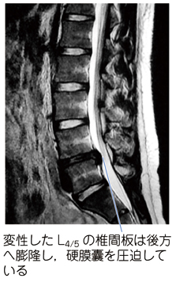

# 腰椎椎間板ヘルニア

> 椎間板の髄核などが後方へ突出し、腰痛や坐骨神経痛、神経根障害をきたす疾患。診察では疼痛分布と筋力・感覚を神経根ごとに評価する。

## 要点

- **L4/5椎間板ヘルニア → L5神経根障害**が典型的で、下腿外側〜足背の知覚障害、母趾・足趾背屈低下をきたす。
- L5神経根は前脛骨筋・長母趾伸筋・長指伸筋などに関与し、足関節背屈・母趾伸展が低下する。
- L5/S1ではS1神経根が障害され、下腿後面〜足外側の感覚障害や足関節底屈低下が目立つ。
- L3/4→L4神経根：大腿四頭筋・膝伸展低下、下腿内側の知覚低下、膝蓋腱反射低下。
- L4/5→L5神経根：前脛骨筋・長母趾伸筋、足関節／母趾背屈低下、足背の知覚低下。
- L5/S1→S1神経根：下腿三頭筋・足関節底屈低下、足部外側の知覚低下、アキレス腱反射低下。
- 筋力低下や進行性の神経症状がある場合は、椎間板と神経根を評価できる**腰部MRI**を行う。
- 腰椎単純X線は骨性変化や不安定性の評価には有用だが、椎間板・神経根の直接評価には不十分である。
- 膀胱直腸障害、会陰部感覚障害、急速な麻痺進行があれば馬尾症候群を疑い、緊急評価する。

## CBTチェック

- L4/5ヘルニア＋足背の感覚障害＋足趾背屈低下 → **L5神経根障害**。
- 「L4/5椎間板ヘルニア＋足関節背屈障害」→ L5神経根障害を考える。
- 膝関節伸展低下 → L4・大腿四頭筋。足関節底屈低下 → S1・下腿三頭筋。
- 神経学的異常を伴う腰痛の画像検査 → **腰部MRI**。

提示画像（M3E問題280525304、個人学習用）。L4/5椎間板が後方へ膨隆し、硬膜嚢を圧迫している。
