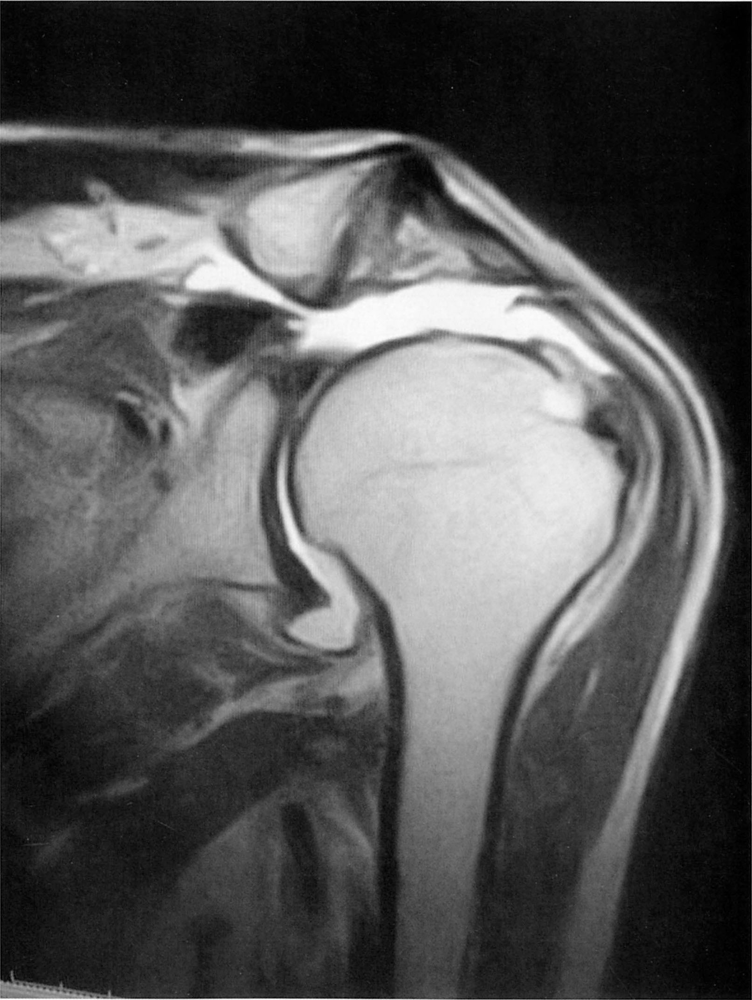

# 腱板断裂

> [[肩腱板の付着部]]を構成する腱（特に棘上筋腱）が部分的または完全に断裂した状態。疼痛と筋力低下、自動挙上障害を来す。

## 要点

- 外傷後または腱の変性を背景に発症し、疼痛よりも筋力低下が目立つことがある。
- 自動可動域は低下するが、他動可動域は比較的保たれることが多い。急性の強い疼痛で他動運動も制限される場合は[[石灰沈着性腱板炎]]などを考える。
- MRIでは腱の連続性消失、液体信号を伴う欠損、腱の退縮などを確認する。診断は診察と画像検査を組み合わせて行う。
- Drop armテスト（下垂腕試験）は、外転位からゆっくり下ろす際に腕を保持できず落下するかをみる。棘上筋を中心とする腱板断裂で陽性となる。

画像：肩関節MRI冠状断。棘上筋腱の連続性消失と欠損（矢印部）が腱板断裂を示唆する。出典：ユーザー提示画像（個人学習用）。

## CBTチェック

- 「外傷後の挙上不能」「自動可動域低下に比べ他動可動域が保たれる」→ 腱板断裂を考える。
- MRIの「腱の連続性消失・液体信号を伴う欠損・腱の退縮」→ 腱板断裂を考える。
- 「Drop armテスト陽性」→ 腱板断裂（特に完全な棘上筋腱断裂）を考える。
- 中年女性の誘因のない突然の激痛＋疼痛による運動制限 → [[石灰沈着性腱板炎]]を対比する。
