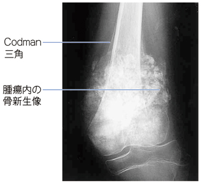
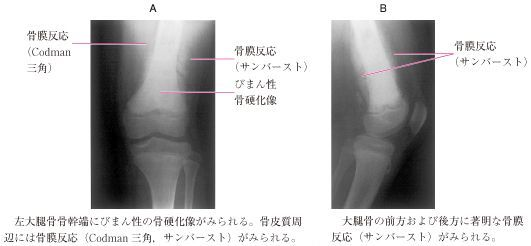

# 骨肉腫

> 骨肉腫は、腫瘍細胞が類骨（腫瘍性骨）を産生する原発性悪性骨腫瘍で、10歳代の長管骨骨幹端に好発する。

## 要点

- 好発部位は膝関節周囲、特に大腿骨遠位・脛骨近位の骨幹端。
- X線では骨破壊と腫瘍性骨形成を示し、Codman三角やspicula（放射状・棘状骨形成）が手掛かり。
- 進行する局所痛・腫脹、関節周囲の運動制限を来す。LD・ALP上昇は補助所見だが、腫瘍特異的ではない。
- プロカルシトニン正常は細菌感染を支持しにくくするが、骨髄炎などの感染を完全に否定する所見ではない。
- 診断は画像検査に加えて生検で確定し、治療は化学療法と広範切除を組み合わせる。
- 「10歳代＋膝周囲の骨幹端＋骨膜反応」→ 骨肉腫を考える。
- 鑑別では、骨幹部に好発するEwing肉腫と部位を区別する。
- 遠隔転移は肺が重要で、診断後の病期評価に胸部画像を行う。

画像はM3E問題280525263の提示画像（個人学習用）。大腿骨遠位骨幹端にCodman三角と腫瘍内骨新生を認める。

画像はM3E問題281488457の提示画像（個人学習用）。大腿骨遠位骨幹端に骨膜反応（Codman三角、sunburst）と骨硬化像を認める。

## CBTチェック

- 問題文の「10歳代」「膝関節周囲の骨幹端」→ 骨肉腫。
- 「Codman三角」「spicula」→ 悪性骨腫瘍の骨膜反応、特に骨肉腫を考える。
- 「骨幹部＋若年者」→ Ewing肉腫を連想する。
- 「腫脹が短期間に増大」＋「膝周囲の骨幹端病変」→ 骨肉腫を考える。疲労骨折では骨折線が中心となる。
