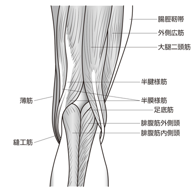

# 鵞足炎

> 鵞足（縫工筋・薄筋・半腱様筋の共同停止部）周囲の滑液包や腱の炎症。膝関節裂隙よりやや下方の内側膝痛を来し、階段昇降や深い膝屈曲（正座など）で悪化しうる。

## 要点

- 鵞足を構成するのは、上から縫工筋・薄筋・半腱様筋。3筋はいずれも脛骨近位内側（脛骨粗面の内側かつやや下方）に停止する。
- 半膜様筋は鵞足を構成せず、脛骨内側顆後面に停止する。半腱様筋と同じハムストリングに含まれるため混同しやすい。
- 膝関節裂隙そのものより2〜5 cm下方の脛骨近位内側に圧痛があり、ランニング・階段・正座などの反復する膝屈曲で痛みが誘発される。
- 肥満、膝の変形、[[糖尿病]]、スポーツなどが発症に関与する。診断は圧痛部位と症状を中心に行い、必要に応じて超音波やMRIを用いる。
- 関節内炎症ではなく鵞足周囲の炎症であり、内側半月板損傷や内側側副靱帯損傷、[[変形性膝関節症]]と鑑別する。

鵞足を構成する縫工筋・薄筋・半腱様筋と、鵞足を構成しない半膜様筋（M3E問題画像、個人学習用）。

## CBTチェック

- 「膝関節裂隙より下方の内側圧痛」＋「正座や階段で増悪」→ 鵞足炎を考える。
- 「縫工筋・薄筋・半腱様筋」→ 鵞足。「半膜様筋」→ 鵞足ではない。
- 「脛骨粗面」→ 膝蓋靱帯の停止部。「鵞足」→ 脛骨近位内側面で、脛骨粗面そのものではない。
