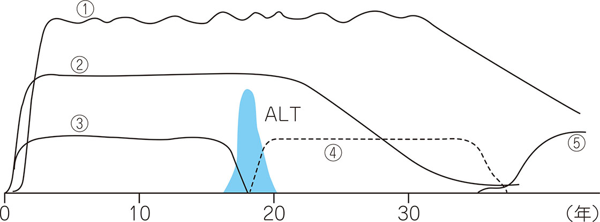
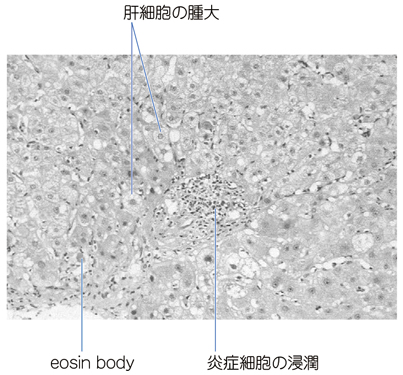

# B型肝炎

> B型肝炎は、DNAウイルスであるB型肝炎ウイルス（hepatitis B virus：HBV）による肝炎である。血液・体液を介して感染し、急性肝炎または持続感染による慢性肝炎を来す。

## 要点

- 急性肝炎では食欲不振、倦怠感、悪心、黄疸などを認め、AST・ALTが著明に上昇する。
- **HBs抗原陽性**は現在のHBV感染、IgM-HBc抗体陽性は急性感染を示唆する。HBs抗体は中和抗体で、感染防御を示す。
- **HBe抗原陽性**は一般にHBV増殖が活発で感染性が高い状態を示し、HBe抗体へのセロコンバージョンで増殖は低下することが多い。
- HBe抗原の陰性化とHBe抗体の陽性化を**HBeセロコンバージョン**といい、ウイルス増殖低下・肝炎沈静化の目安である。ただし、これだけでは急性肝炎の治癒判定にはならない。
- 急性B型肝炎の回復は、HBs抗原が消失し、**HBs抗体（anti-HBs）が陽性化**することで確認する（CBTでは「HBs抗体陽性化＝治癒判定」と整理する）。HBc抗体IgGは既往感染の証拠として残る。
- HBs抗原が消失してからHBs抗体が出現するまでのwindow periodでは、IgM-HBc抗体が診断マーカーとなる。
- **S（surface）**は表面：HBs抗原陽性は現在感染、HBs抗体陽性は感染防御（既往感染またはワクチン接種後）を示す。
- **C（core）**は核：HBc抗体はHBV感染の既往を示し、IgM-HBc抗体は急性感染（または慢性肝炎の急性増悪）で上昇する。
- **E（e）**は増殖の目安：HBe抗原陽性は一般にウイルス量・感染性が高く、HBe抗体陽性では低いことが多い。

HBVキャリアでは、ALT上昇を伴う肝炎活動期の後にHBe抗原（③）が陰性化し、HBe抗体（④）が出現する。

出典：メディックメディア「からだクイズ」医CBT類題（個人学習用）

- 母子感染、性行為、針刺し・血液曝露で感染する。母子感染は主に分娩時に起こり、HBs抗原陽性の母からの出生児には出生後速やかにHBワクチンと抗HBsヒト免疫グロブリン（HBIG）を投与する。
- HBe抗原陰性でも出生児は予防の対象である。適切な予防後は授乳を禁止しない。
- HBs抗原陰性でもHBc抗体またはHBs抗体陽性の既往感染者は、免疫抑制・化学療法で[[HBV再活性化]]を起こしうる。
- B型慢性肝炎の抗ウイルス治療にはPeg-IFN（ペグインターフェロン）または核酸アナログ製剤を用いる。
- 成人の急性感染は多くが自然軽快するが、劇症化・慢性化の評価が必要である。慢性化は肝硬変・[[肝細胞癌]]のリスクとなるが、肝癌の背景には[[C型肝炎]]も重要である。

肝細胞腫大、炎症細胞浸潤、好酸小体を認める急性肝炎のH-E像（M3E 18302820、個人学習用）。B型の確定には血清HBVマーカーを用いる。

## CBTチェック

- AST・ALT著明高値＋HBs抗原・HBe抗原陽性 → 活動性の高いB型肝炎を考える（M3E 18302820）。
- HBs抗原＝現在感染、HBs抗体＝中和抗体による感染防御、HBe抗原＝ウイルス増殖・感染性の目安。
- HBeセロコンバージョン（HBe抗原→HBe抗体）は沈静化の目安、HBs抗原消失＋HBs抗体陽性化は急性感染の回復所見。
- 急性感染の確認にはIgM-HBc抗体が重要であり、HBs抗原陽性だけでは急性・慢性を区別できない。
- B型慢性肝炎の治療：Peg-IFN または核酸アナログ製剤。
