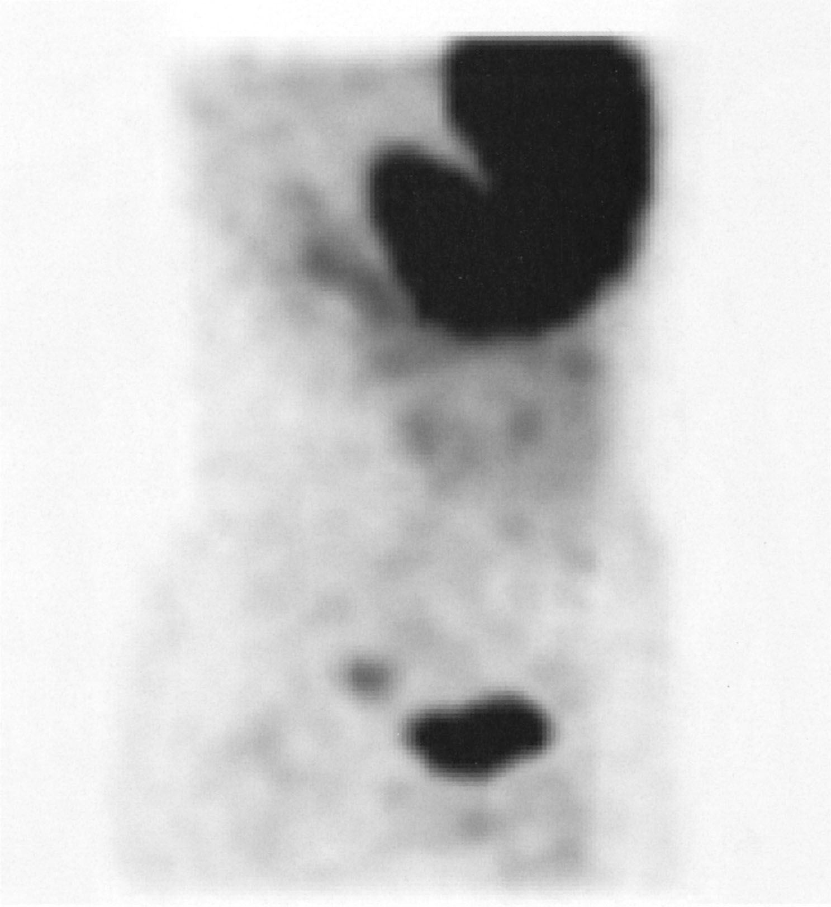

# Meckel憩室

> [[Meckel憩室]]は卵黄腸管遺残による回腸の先天性**真性憩室**で、異所性胃粘膜による消化管出血や腸重積を起こしうる。

## 要点

- 回盲部近くの回腸・腸間膜対側に生じ、消化管壁の全層を含む。
- 異所性胃粘膜からの酸分泌 → 隣接回腸の潰瘍 → 無痛性下血を来すことがある。
- 腸重積や腸閉塞の先進部になりうるため、学童以降の[[腸重積症]]では器質的病変を考える。
- 99mTcO4−シンチグラムは異所性胃粘膜に集積し、Meckel憩室の診断に用いる。ただし異所性胃粘膜を含まない場合は検出できない。

## CBTチェック

- 「小児の無痛性下血」→Meckel憩室を考え、99mTcO4−シンチグラムを選ぶ。
- Meckel憩室は真性憩室である（[[真性憩室と仮性憩室]]）。
- 腸重積後にシンチグラムで異所性胃粘膜を示す集積 → Meckel憩室（[118回D-66](../../医師国家試験/118回/D/66.md)）。

99mTcO4−シンチグラムでは胃と同時に腹部の異所性胃粘膜へ集積を認める。

*出典：メディックメディア「からだクイズ」医118D66（個人学習用）*
