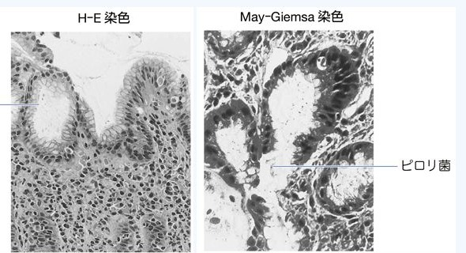

# ヘリコバクター・ピロリ感染症

> **Helicobacter pylori（H. pylori）感染症**は、胃粘膜に持続感染して慢性胃炎を起こし、消化性潰瘍や胃癌などの原因となる感染症である。

## 要点

- 関連疾患は[胃潰瘍](胃潰瘍.md)・[[十二指腸潰瘍]]、萎縮性胃炎、[[胃癌]]、[[胃MALTリンパ腫]]、[免疫性血小板減少症](../血液/免疫性血小板減少症.md)である。
- 除菌により消化性潰瘍の治癒・再発予防、胃癌発症リスクの低下が期待できる。胃癌リスクは除菌後も残るため、必要な内視鏡フォローを続ける。
- 限局期のH. pylori陽性胃MALTリンパ腫では、除菌療法が第一選択となる。
- H. pylori陽性の免疫性血小板減少症では、除菌により血小板数が改善することがある。
- [[逆流性食道炎]]は除菌による予防対象ではない。除菌後に一時的な発症・増悪を認めることはあるが、これを理由に必要な除菌を控えない。

胃生検のH-E染色とMay-Giemsa染色では、胃粘膜表層のH. pyloriを確認できる。

出典：M3E CBT 問題番号18204420（個人学習用）

## CBTチェック

- H. pylori関連疾患 → 消化性潰瘍・胃癌・胃MALTリンパ腫・免疫性血小板減少症。
- 「リンパ腫」は特に[[胃MALTリンパ腫]]との関連を押さえる。
- 除菌が予防に有効でない疾患として、逆流性食道炎が問われる。
- [[尿素呼気試験]]はH. pylori感染の検査法であり、除菌判定にも用いる。
