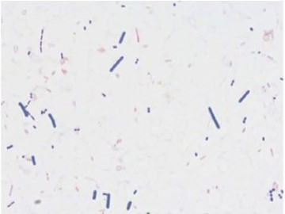

# 偽膜性腸炎

> **偽膜性腸炎（pseudomembranous colitis）**は、多くは抗菌薬投与後に腸内細菌叢が乱れ、Clostridioides difficile（旧名 Clostridium difficile）が増殖して起こる大腸炎である。

## 要点

- 抗菌薬投与 → 菌交代現象 → C. difficileが増殖 → 毒素A・Bによる大腸粘膜傷害、という流れで発症する。
- 水様性下痢、発熱、下腹部痛・圧痛、白血球増多が典型で、高齢・入院歴はリスクとなる。
- 便中GDH抗原・毒素検査や核酸増幅検査（NAAT）で診断し、内視鏡では黄白色の偽膜を認める。
- 原因抗菌薬を可能なら中止し、重症度・再発リスクに応じて経口バンコマイシンまたはフィダキソマイシンを用いる。
- 芽胞はアルコールに強いため、流水と石けんによる手指衛生と接触予防策が重要である。重症例では[中毒性巨大結腸症](中毒性巨大結腸症.md)や穿孔を合併する。

便から分離されたC. difficileの[グラム染色](../../04_検査/染色法/グラム染色.md)像。グラム陽性桿菌としてみえる。

出典：M3E CBT 問題番号18103670（個人学習用）

## CBTチェック

- **抗菌薬投与後の発熱・下痢・下腹部圧痛**から偽膜性腸炎を疑う。
- C. difficileは芽胞を形成する偏性嫌気性グラム陽性桿菌である。
- 内視鏡の黄白色偽膜、C. difficile、菌交代現象の組合せを確認する。
- 抗菌薬後でも急性血便が主体で、横行結腸の出血性粘膜を認めれば[[抗菌薬関連出血性大腸炎]]を考える。
- C. difficileは[芽胞](../../01_基礎医学/微生物/細菌/芽胞.md)形成菌であり、アルコール消毒だけでは不十分である。
