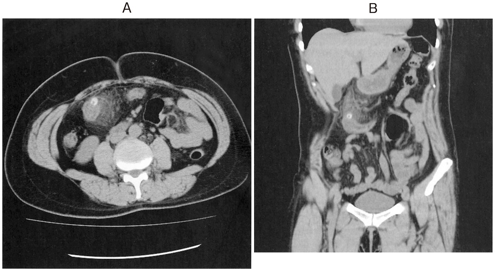

# 大腸憩室炎

> 大腸憩室炎は、大腸憩室の炎症により腹痛・発熱・炎症反応上昇を来す病態。CTで大腸壁肥厚と周囲脂肪織濃度上昇を認める。

## 要点

- 憩室は多くが固有筋層を欠く[[仮性憩室]]で、結腸の血管貫通部から粘膜・粘膜下層が突出する。
- 腹痛、圧痛、発熱、白血球増多・CRP上昇が典型で、右側結腸では[[急性虫垂炎]]と鑑別する。
- CTでは憩室、局所的な腸管壁肥厚、周囲脂肪織濃度上昇を確認し、膿瘍・穿孔の有無を評価する。
- 国試では、腹膜炎や膿瘍のない例は腸管安静と抗菌薬投与が基本である。近年は、全身炎症の乏しい免疫健常者の単純例では抗菌薬を省略する指針もある。

## CBTチェック

- 大腸憩室炎は腹痛と炎症反応上昇を呈するが、[[憩室出血]]とは異なり下血は主症状ではない。
- CTで「大腸壁肥厚＋周囲脂肪織濃度上昇」→大腸憩室炎を考える（[111回A-48](../../医師国家試験/111回/A/48.md)）。

CTでは右側結腸の憩室と周囲脂肪織濃度上昇を認める。

*出典：メディックメディア「からだクイズ」医111A48（個人学習用）*
