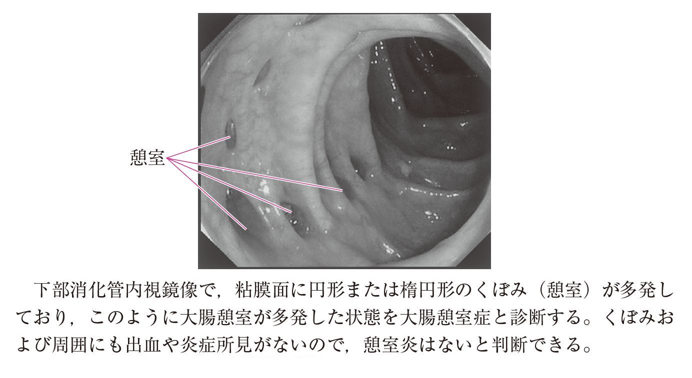

# 大腸憩室症

> **大腸憩室症**は、結腸壁から粘膜・粘膜下層が嚢状に突出する大腸憩室が多発した状態である。多くは仮性憩室で、炎症や出血を伴わない無症候例は経過観察とする。

## 要点

- 大腸憩室の大部分は固有筋層を欠く仮性憩室であり、全層を含む真性憩室は少ない。
- 憩室炎を起こすと腹痛、発熱、白血球増多・CRP上昇を呈し、憩室出血では突然の下血をきたす。
- 無症候性の大腸憩室症は通常、特別な治療を要さず経過観察とする。
- 以前は欧米で左側結腸、日本で右側結腸に多いとされたが、日本でも食生活の変化などにより左側病変が増えている。

## 画像

下部消化管内視鏡で、炎症や出血を伴わない円形・楕円形のくぼみ（憩室）が多発している（問題画像、個人学習用）。

## CBTチェック

- 無症候＋炎症所見なし＋内視鏡で憩室多発 → 大腸憩室症、経過観察。
- 憩室＋腹痛・発熱・炎症反応上昇 → [[大腸憩室炎]]。
- 憩室＋突然の下血 → [[憩室出血]]を考える。

