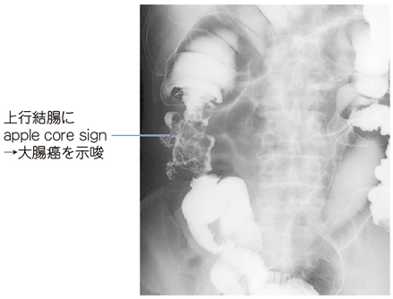
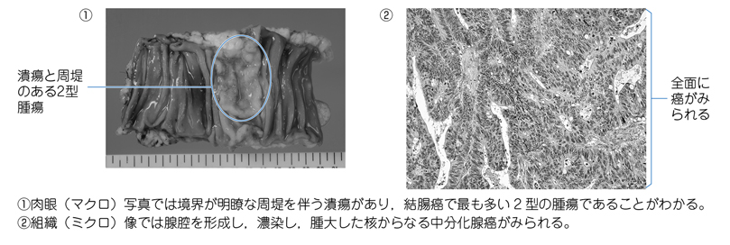
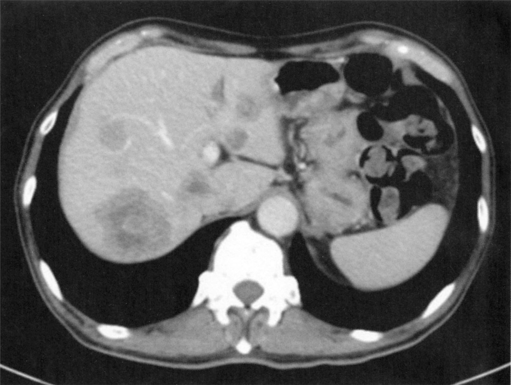

# 大腸癌

> 大腸粘膜上皮から発生する悪性腫瘍。早期は無症状のことが多く、進行すると血便・便通異常・腸閉塞をきたす。

## 要点

- スクリーニングには便潜血検査（免疫法・2日法）を用いる。陽性時は大腸内視鏡検査で精査する。
- 診断は大腸内視鏡検査と生検で行い、CTなどで進展・転移を評価する。
- 注腸造影では、腫瘍による輪状狭窄が **apple core sign** として見えることがある。S状結腸は好発部位の一つである。
- 腫瘍マーカーはCEA、CA19-9を治療効果・再発の経過観察に用いる。AFPは[[肝細胞癌]]で用いる。
- 血行性転移は肝が最も多く、次いで肺。切除可能な肝・肺転移では外科的切除を検討する。
- 多発などで切除不能な肝転移では、全身薬物療法を行い、奏効後に切除可能となることがある。
- 肉眼型は[大腸癌の肉眼分類](大腸癌の肉眼分類.md)を参照する。進行癌では2型（潰瘍限局型）が多い。
- 大腸癌の大部分は腺癌である。肉眼では潰瘍と周堤を伴う2型（潰瘍限局型）が典型的で、組織では腺管形成を示す異型腺上皮がみられる。
- 鑑別では、腸結核は輪状潰瘍・乾酪壊死性肉芽腫、潰瘍性大腸炎は平坦なびまん性粘膜病変・陰窩膿瘍、Crohn病は縦走潰瘍・敷石像・skip lesion・非乾酪性肉芽腫を示す。
- [[Lynch症候群]]（遺伝性非ポリポーシス大腸癌：HNPCC）は、DNAミスマッチ修復機構の異常による遺伝性大腸癌である。主な関連遺伝子はMLH1、MSH2（hMSH2）、MSH6、PMS2、EPCAMで、腫瘍ではマイクロサテライト不安定性（MSI）を示しうる。

## CBTチェック

- 大腸癌検診 → 便潜血検査（2日法）。
- 病期（stage）は壁深達度（T）、所属リンパ節転移（N）、遠隔転移（M）で規定する。組織学的分類は病期を規定しない（[102回E-28](../../医師国家試験/102回/E/28.md)）。
- AFPではなくCEAが大腸癌の経過観察に有用。
- 血便 + 注腸造影のapple core sign → 大腸癌（この設問ではS状結腸）。
- 肝転移があっても、切除可能なら手術を検討する。

注腸造影で、腫瘍による輪状狭窄がリンゴの芯状にみえる **apple core sign**。大腸癌を示唆する（ユーザー提供、個人学習用）。

潰瘍と周堤を伴う2型大腸癌の肉眼像（①）と、腺管形成を示す腺癌の病理像（②）（ユーザー提供、個人学習用）。

造影CTでは両葉に多発する低吸収域として大腸癌肝転移を認める。

*出典：メディックメディア「からだクイズ」医113A16（個人学習用）*
