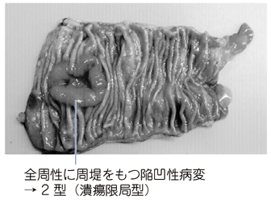

# 大腸癌の肉眼分類

> [[大腸癌]]を肉眼形態で0～5型に分ける分類。0型は早期癌に用い、1～5型は主に進行癌に用いる。

## 要点

- 0型（表在型）：粘膜または粘膜下層までにとどまる癌。隆起型（0-I）と表面型（0-II）に分ける。
- 1型（腫瘤型）：腫瘍が塊状に隆起し、明らかな潰瘍を主体としない。
- 2型（潰瘍限局型）：中央に潰瘍があり、周囲の盛り上がり（周堤）と正常粘膜との境界が明瞭。
- 3型（潰瘍浸潤型）：潰瘍周囲の周堤が崩れ、正常粘膜との境界が不明瞭。
- 4型はびまん浸潤型、5型は分類不能。進行大腸癌では2型が最も多い。

中央の潰瘍を境界明瞭な全周性周堤が囲むため、2型（潰瘍限局型）と判断する。

出典：M3E CBT 問題番号18204440（個人学習用）

## CBTチェック

- 中央潰瘍＋境界明瞭な周堤 → 2型。周堤の隆起だけを見て1型と誤認しない。
- 2型と3型の鑑別点は境界で、明瞭なら2型、不明瞭なら3型。
- 今回は前回回答B（1型）に対して正答C（2型）：誤りは肉眼所見の分類取り違え。
