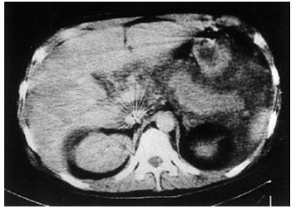

# 急性膵炎

> **急性膵炎**は膵酵素の活性化により膵に急性炎症が起こる病態である。主な原因は飲酒と胆石で、急な上腹部痛をきたす。

## 要点

- 診断は、典型的な腹痛、膵酵素上昇、画像所見のうち2項目以上を目安とする。
- CTでは膵腫大、不均一な膵実質、膵周囲の炎症や液体貯留を認めうる。
- 重症度や膵壊死の評価には造影CTが有用である。
- 初期治療は輸液、鎮痛、早期経腸栄養を基本とする。
- 胆石性で胆管炎または持続する胆道閉塞を伴う場合は、緊急ERCPを考慮する。
- アルコール，胆石，特発性が三大成因である。１％ほどが脂質異常症。
- 重症化では血管透過性亢進によりthird spaceへ体液が移動し、有効循環血漿量が減少する。乏尿、腎機能低下、腹水・胸水、呼吸不全や[ARDS](../呼吸器/ARDS.md)をきたしうる。
- 後腹膜・腹腔内出血では側腹部の皮下出血（Grey Turner徴候）や臍周囲の皮下出血（Cullen徴候）を認めることがある。
- 腹水・膵周囲液体貯留・膵壊死は、膵炎が局所で強く進展している所見である。血管透過性亢進によるthird space移行は、脱水・ショックから腎障害につながる。
- 全身性炎症反応（SIRS）が進むと、ARDS・DICなどの多臓器障害を起こしうる。低Ca血症も重症急性膵炎でみられる重要な検査異常である。

膵腫大と腎周囲を含む液体貯留を示すCT。急性膵炎では炎症の膵周囲への波及を評価する。

出典：M3E CBT 問題番号18105350（個人学習用）

## CBTチェック

- 大量飲酒後の上腹部痛 + 膵腫大・膵周囲液体貯留 → 急性膵炎。
- 急性膵炎では脂肪壊死に伴うけん化のため、血清Caが低下しうる。CRP・白血球・血糖・アミラーゼは上昇しうる。
- 重症化では、Base excess低下、LDH上昇、血小板低下、腎機能低下、低Ca血症、CRP上昇を認めうる。重症度は予後因子と造影CT所見で判定する。
- 腹痛の強さは重症度と必ずしも相関しない。多尿は典型的ではなく、乏尿は重症化を示唆する。
- CBTの流れ：膵から水が漏れる → 腹水・胸水 → 脱水／ショック → 腎不全 → SIRS → ARDS・DIC。
- [[慢性膵炎]]では膵萎縮、石灰化、主膵管拡張をみる。
- 消化管穿孔では腹部X線でfree airを認めることが多い。
