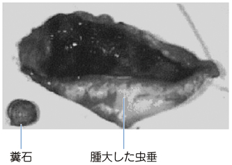
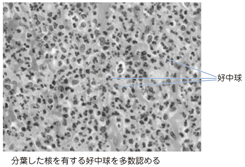

# 急性虫垂炎

> 虫垂内腔の閉塞を契機に炎症・感染を生じる急性腹症である。典型例では痛みが心窩部・臍周囲から右下腹部へ移動する。

## 要点

- 糞石やリンパ濾胞過形成による虫垂内腔の閉塞 → 細菌増殖・炎症 → 壊死・穿孔へ進展しうる。
- 右下腹部圧痛、反跳痛、筋性防御は腹膜刺激症状で、発熱、白血球・CRP上昇を伴うことが多い。
- 超音波検査では腫大した虫垂や糞石を確認する。診断が不確実な成人ではCTも有用である。
- 腹膜刺激症状がある場合、[[注腸造影]]は穿孔を悪化させうるため**禁忌**である。
- 小児・高齢者・妊婦では典型症状に乏しく、診断遅れから穿孔・[[汎発性腹膜炎]]に注意する。
- 治療は外科的切除が基本で、病態に応じて抗菌薬治療を行う。

摘出虫垂の糞石と腫大を示す。

出典：M3E CBT 問題番号18304124（ユーザー提示、個人学習用）

急性炎症でみられる分葉核をもつ[[好中球]]の浸潤を示す病理像。

出典：M3E CBT 問題番号18304114（ユーザー提示、個人学習用）

## CBTチェック

- 心窩部・臍周囲痛が右下腹部へ移動＋反跳痛 → 急性虫垂炎を考える。
- 腹膜刺激症状がある場合、[[注腸造影]]は**禁忌**である。
- 乳幼児では症状が非典型的で、穿孔例が多い。
- 糞石は虫垂内腔閉塞の代表的原因である。
