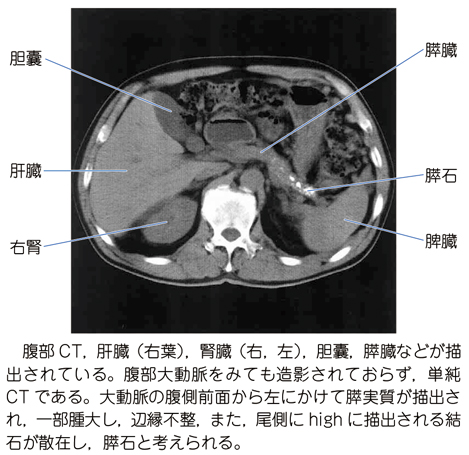

# 慢性膵炎

> **慢性膵炎**は、膵実質の線維化・破壊が進行し、膵外分泌機能と内分泌機能が低下する不可逆性の炎症性疾患である。

## 要点

- 上腹部痛・背部痛を反復し、持続性または食後に増悪する痛みを認める。鎮痛薬依存につながることもある。
- CTでは、**膵石、主膵管の不規則な拡張・狭窄、膵実質の萎縮**が典型的である。膵石は蛋白栓へのカルシウム沈着などで形成される。
- 膵外分泌不全 → 消化酵素低下 → 脂肪便、下痢、体重減少、脂溶性ビタミン欠乏。
- 膵内分泌不全 → インスリン分泌低下 → 糖尿病（膵性糖尿病）。
- 合併症として膵仮性嚢胞、胆道・十二指腸狭窄、膵癌などに注意する。

## 画像

膵実質の萎縮、主膵管の拡張・狭窄、膵石を示す腹部CT（問題画像、個人学習用）。

## CBTチェック

- 膵石＋主膵管拡張＋膵萎縮 → 慢性膵炎。
- 脂肪便・体重減少 → 膵外分泌不全を考える。
- 慢性膵炎では膵内・外分泌機能がともに低下しうる。急性膵炎のような膵腫大とは対照的に、進行例では膵萎縮が目立つ。

