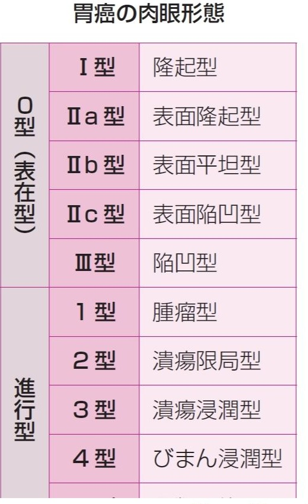

# 早期胃癌の肉眼分類

> **早期胃癌**は、リンパ節転移の有無にかかわらず癌の深達度が粘膜下層までの胃癌である。肉眼型は0型（表在型）に分類する。

## 要点

| 型 | 名称 | 所見 |
|---|---|---|
| 0-I | 隆起型 | 明らかな隆起 |
| 0-IIa | 表面隆起型 | 軽度の隆起 |
| 0-IIb | 表面平坦型 | 平坦 |
| 0-IIc | 表面陥凹型 | 浅い陥凹 |
| 0-III | 陥凹型 | 深い陥凹 |

胃癌の肉眼分類。0型は早期胃癌、1〜4型は進行胃癌に用いる。

出典：M3E CBT 問題番号10630080（個人学習用）

- 進行胃癌の1〜4型は[[進行胃癌の肉眼分類]]を参照する。

## CBTチェック

- **0-IIc = 表面陥凹型早期胃癌**。
- 0-IIaは表面隆起型、0-IIbは表面平坦型、0-IIIは陥凹型。
