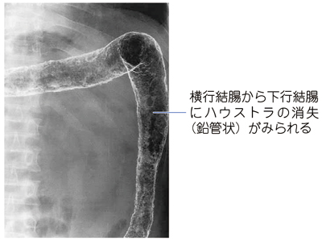

# 潰瘍性大腸炎

> **潰瘍性大腸炎（ulcerative colitis：UC）**は、大腸粘膜を直腸から口側へ連続性に侵す慢性の[[炎症性腸疾患]]である。粘血便・下痢を反復し、重症例では[[中毒性巨大結腸症]]や消化管穿孔を合併する。

## 要点

- 慢性・反復性の粘血便、下痢、腹痛を呈する。診断時には便培養、渡航歴などから[[感染性腸炎]]を除外する。
- 大腸内視鏡では直腸から連続するびまん性炎症、易出血性粘膜、びらん・潰瘍、偽ポリポーシスを認める。
- 病変は主に**粘膜・粘膜下層**に限局し、病理では陰窩への好中球集簇（[[陰窩膿瘍]]）が特徴である。
- 注腸造影ではハウストラが消失した**鉛管像**を示すが、現在は診断の中心ではなく、重症活動期には行わない。
- 合併症として[[中毒性巨大結腸症]]、穿孔、大腸癌、[[原発性硬化性胆管炎]]に注意する。

関連：[吐血・下血の鑑別](../../02_症候・診察/吐血・下血の鑑別.md)

注腸造影で横行結腸から下行結腸のハウストラが消失した鉛管像を示す。重症活動期には施行しない。

## CBTチェック

- **直腸から連続する病変・陰窩膿瘍・偽ポリポーシス**は潰瘍性大腸炎の組合せ。
- 全層性炎症、縦走潰瘍、敷石像、非乾酪性肉芽腫は[[クローン病]]を示唆する。
- **消化管穿孔が疑われる場合は大腸内視鏡を行わない。[[中毒性巨大結腸症]]が疑われる場合は、全大腸内視鏡・注腸検査・通常の腸管前処置を原則行わず**、腹部単純X線やCTで評価する。
