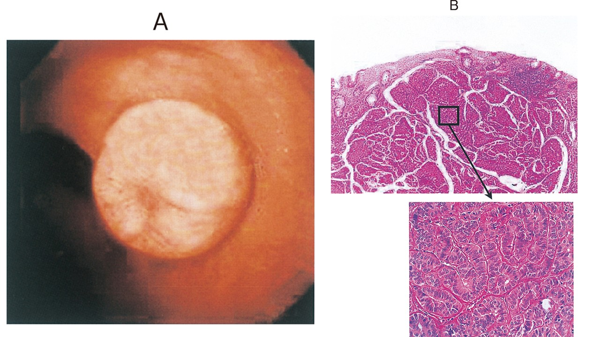

# 直腸神経内分泌腫瘍

> [[直腸神経内分泌腫瘍]]（NET）は、かつてカルチノイドと呼ばれた分化のよい神経内分泌腫瘍。直腸では小さな黄白色の粘膜下腫瘍様病変としてみつかる。

## 要点

- 内視鏡では正常に近い粘膜に覆われた、黄白色調で平滑な隆起としてみられる。
- 病理では均一な腫瘍細胞が胞巣状・索状に増殖する。診断は[[クロモグラニンA]]・[[シナプトフィジン]]などの免疫染色で補助する。
- 腫瘍径、固有筋層浸潤、脈管侵襲、グレードが転移リスクに関わる。
- 小さく固有筋層浸潤のない病変は内視鏡切除を行い、大きい病変や固有筋層浸潤例は外科的切除を検討する。
- 局所の直腸NETで[[カルチノイド症候群]]を来すことは通常ない。

## CBTチェック

- 直腸の「黄白色・粘膜下腫瘍様」の小隆起 → 直腸NET（カルチノイド）を考える。
- 選択肢にカルチノイドがあれば、現在の名称は分化のよい神経内分泌腫瘍である（[101回G-27](../../医師国家試験/101回/G/27.md)）。

Aは直腸の黄白色調の隆起、Bは均一な腫瘍細胞が胞巣状に増殖する病理像を示す。

*出典：メディックメディア「からだクイズ」医101G27（個人学習用）*
