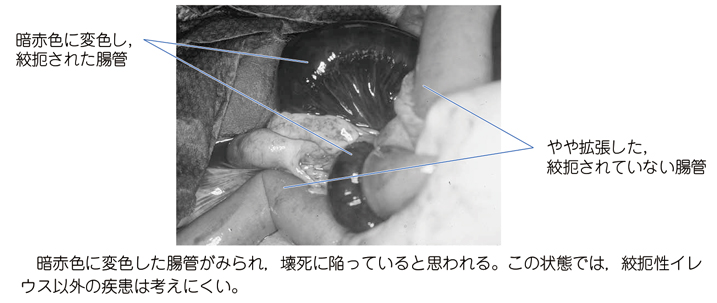

# 絞扼性イレウス

> 腸管が癒着索・ヘルニア・軸捻転などで締め付けられ、閉塞に加えて血流障害を起こす腸閉塞。腸管壊死・穿孔へ進行するため緊急手術を要する。

## 要点

- 開腹術後の癒着は重要な原因である。
- 急激で持続する強い腹痛、嘔吐、腹部膨満、筋性防御は腸管虚血を示唆する。
- 造影腹部CTでclosed loop、腸管壁の造影不良、腸間膜浮腫、腹水を評価する。
- 絞扼が疑われる場合は、輸液・胃管などの初期対応と並行して緊急手術を検討する。

暗赤色に変色した絞扼腸管は、うっ血から腸管壊死へ進行した所見である。

出典：M3E CBT 問題番号18204550（個人学習用）

## CBTチェック

- 開腹術後＋激しい腹痛＋筋性防御 → 絞扼性イレウスを疑う。
- 単純性癒着性イレウスは血流障害を伴わず、絞扼性では腸管虚血・壊死を伴う。
- 麻痺性イレウスは腸管運動の低下による機能的閉塞であり、絞扼性と区別する。
