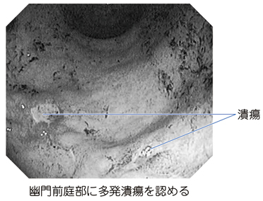

# 胃潰瘍

> 胃粘膜の傷害が粘膜筋板を超えて達する[[消化性潰瘍]]である。主な原因は[ヘリコバクター・ピロリ感染症](ヘリコバクター・ピロリ感染症.md)とNSAIDsで、出血時には黒色便をきたす。

## 要点

- H. pylori感染とNSAIDs使用は胃・十二指腸潰瘍の二大原因である。
- 心窩部痛、悪心、胸やけ様症状を認め、出血すれば黒色便、貧血、頻脈をきたす。
- 診断には上部消化管内視鏡を行い、出血の評価・内視鏡的止血と、悪性潰瘍の除外を行う。
- 治療はNSAIDsの中止・調整、プロトンポンプ阻害薬（PPI）投与、H. pylori陽性例での除菌である。
- 穿孔では突然の強い腹痛・腹膜刺激症状を呈し、緊急対応を要する。

幽門前庭部の多発潰瘍を示す上部消化管内視鏡像。

出典：M3E CBT 問題番号18304284（ユーザー提示、個人学習用）

## CBTチェック

- 黒色便＋NSAIDs使用歴 → 出血性胃・十二指腸潰瘍を考え、上部消化管内視鏡を行う。
- 胃酸と内因子を分泌するのは**壁細胞**である。
- 消化性潰瘍の主な原因はH. pylori感染とNSAIDsである。
