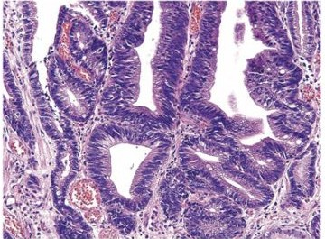

# 胃癌

> **胃癌**は胃粘膜から発生する悪性腫瘍である。治療は深達度・転移・全身状態で決め、切除不能進行例では薬物療法が基本となる。

## 要点

- 早期胃癌でリンパ節転移リスクが低い場合は、[[内視鏡的粘膜下層剝離術（ESD）]]などの内視鏡治療を行う。
- 切除可能な進行胃癌では、胃切除とリンパ節郭清を基本とし、病期に応じて周術期の薬物療法を併用する。
- [[進行胃癌の肉眼分類|4型胃癌]]はびまん浸潤型で、腹膜播種のリスクが高い。
- 腹膜播種・遠隔転移があり治癒切除不能なら、胃切除ではなく全身化学療法を行う。
- 4型では審査腹腔鏡で腹膜播種の有無を評価し、治療方針を決めることがある。
- [[腫瘍マーカー]]はCEA、CA19-9などを補助的に用い、治療効果や再発の経過観察に役立てる。ただし、確定診断や単独のスクリーニングには用いない。
- 胃壁は管腔側から、粘膜（M：粘膜上皮・粘膜固有層・粘膜筋板）、粘膜下層（SM）、固有筋層（MP）、漿膜下層（SS）、漿膜（S）で構成される。
- 深達度がMまたはSMにとどまるものを早期胃癌（リンパ節転移の有無は問わない）、MP以深に及ぶものを進行胃癌と定義する。
- 深達度がMP以深では、切除可能性・リンパ節転移・遠隔転移を総合して胃切除、リンパ節郭清、周術期薬物療法の適応を決める。周囲臓器浸潤や遠隔転移例では根治切除が難しく、薬物療法や症状緩和を検討する。

核の大小不同・異型と腺腔形成を示す胃腺癌（管状腺癌）の病理像。

出典：M3E CBT 問題番号18300890（個人学習用）

## CBTチェック

- 胃癌の多くは腺癌で、腺腔形成と核異型が手掛かりとなる。
- 4型進行胃癌 + 腹膜播種・遠隔転移 → 化学療法。
- 内視鏡的治療は早期胃癌が対象で、4型進行胃癌には適応しない。
- 4型は腫瘤形成が目立たず、胃壁が硬く肥厚するスキルス胃癌として重要である。
