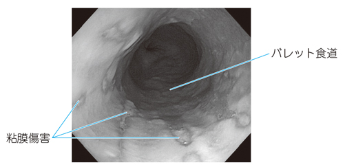

# 胃食道逆流症

> **胃食道逆流症**（GERD）は、胃内容物の食道への逆流によって、胸やけ・呑酸や食道粘膜傷害を生じる病態である。びらんを伴わない非びらん性GERDもある。

## 要点

- 主症状は胸やけ、呑酸、前胸部不快感である。[[嚥下困難]]を伴うこともある。
- 下部食道括約筋の機能低下、食道裂孔ヘルニア、肥満などが逆流を促す。
- 内視鏡では食道下部のびらん・潰瘍を確認する。症状があっても粘膜傷害を認めない例がある。
- 慢性逆流により扁平上皮が円柱上皮へ置換された状態が[[バレット食道]]で、食道腺癌のリスクとなる。
- 治療の基本は生活習慣の調整と酸分泌抑制薬（PPIまたはP-CAB）である。

バレット食道と粘膜傷害を示す内視鏡像（ユーザー提供図、個人学習用）。

## CBTチェック

- 胸やけ・呑酸＋下部食道のびらん → 胃食道逆流症を考える。
- 胃食道逆流症が長期化 → **バレット食道** → 食道腺癌リスク。
- 嚥下困難を伴う場合は、[[食道癌]]・下咽頭癌などの器質的病変も画像・内視鏡で除外する。
