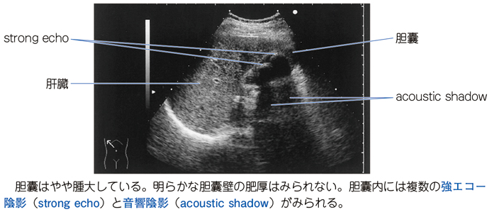

# 胆石症

> **胆石症**は、胆嚢・胆管内に結石ができる状態である。胆嚢結石では右季肋部痛を生じ、胆嚢炎・胆管炎・膵炎を合併しうる。

## 要点

- 胆嚢結石の多くは無症状だが、発作時には右季肋部痛・心窩部痛、悪心・嘔吐を生じる。
- 胆石疝痛では右背部・右肩甲部へ関連痛が放散することがある。胆嚢や横隔膜周囲への刺激が、同じ脊髄分節を介して肩周囲に伝わるためである。
- 胆石の古典的な5Fは female（女性）、forty（40歳代）、fat（肥満）、fair（白人）、fertile／fecund（多産）である。語呂は典型像の想起に用いるが、これらが揃わなくても胆石は生じる。
- 胆石発作は食後、とくに脂肪食後にコレシストキニンで胆嚢が収縮し、胆嚢管が一時閉塞することで誘発される。
- [[急性胆嚢炎]]を合併すると、右季肋部痛に発熱や炎症反応上昇を伴い、画像で胆嚢壁肥厚をみる。
- 総胆管結石では黄疸・胆道系酵素上昇をきたし、[[急性胆管炎]]や[[急性膵炎]]の原因となる。
- 腹部超音波検査が基本で、CTでは石灰化した結石が高吸収域として見えることがある。
- 腹部超音波では、胆嚢内の結石が**強エコー（高エコー）**として描出され、その後方に**音響陰影**を伴う。体位変換で移動することも胆石を示唆する。
- 有症状の胆嚢結石では、腹腔鏡下胆嚢摘出術を検討する。

## CBTチェック

- 胆嚢内の高吸収結石 → 胆石症。
- 胆石 + 胆嚢壁肥厚 → 急性胆嚢炎を考える。
- 胆石 + 黄疸・発熱 → 総胆管結石による急性胆管炎を疑う。

胆嚢内の強エコーと後方音響陰影を示す胆嚢結石の超音波像（ユーザー提供、個人学習用）。

