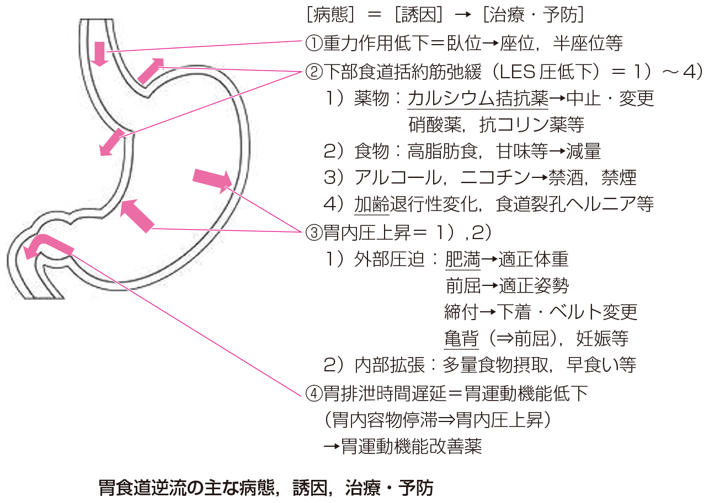

# 逆流性食道炎

> **逆流性食道炎**は、胃内容物の逆流により食道粘膜にびらん・炎症を生じる[[胃食道逆流症]]の一病型である。下部食道括約筋（LES）圧低下と胃内圧上昇が主な病態である。

## 要点

- 胸やけ、呑酸、前胸部痛を呈する。診断は症状、上部消化管内視鏡、必要に応じてpHモニタリングで行う。
- 誘因は肥満、前屈・亀背、食道裂孔ヘルニア、加齢、妊娠、多量摂食などによる胃内圧上昇である。
- [カルシウム拮抗薬](../../06_薬剤/自律神経・循環/カルシウム拮抗薬.md)、硝酸薬、抗コリン薬などはLES圧を低下させ、逆流を起こしやすくする。
- 萎縮性胃炎では胃酸分泌が低下するため、逆流性食道炎の典型的な誘因ではない。
- 治療は生活習慣の調整とプロトンポンプ阻害薬（PPI）が基本である。

胃食道逆流の主な病態、誘因、治療・予防を示す模式図。

出典：M3E CBT 問題番号11600070（個人学習用）

## CBTチェック

- 肥満・亀背・カルシウム拮抗薬 → 逆流性食道炎の誘因。
- 萎縮性胃炎 → 胃酸分泌低下のため、典型的な誘因ではない。
- PPIは胃酸を抑制するが、逆流そのものを完全に防ぐ薬ではない。
