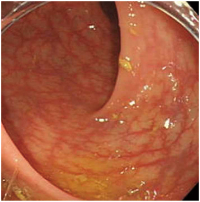

# 過敏性腸症候群

> **過敏性腸症候群**（irritable bowel syndrome：IBS）は、腹痛と便通異常を繰り返すが、器質的疾患を認めない機能性消化管疾患である。腹痛が排便で軽快することが重要な手掛かりとなる。

## 要点

- 腹痛・腹部不快感が排便に関連し、下痢、便秘、または両者の反復を伴う。下痢型・便秘型・混合型に分ける。
- 内視鏡では潰瘍、びらん、腫瘍などの明らかな器質的異常を認めない。画像所見だけで診断せず、症候と器質的疾患の除外を組み合わせる。

本問で提示された下部消化管内視鏡像。明らかな潰瘍や腫瘤を示さない。

- 血便、発熱、体重減少、貧血、夜間症状、発症年齢が高い場合は、[[潰瘍性大腸炎]]・[[クローン病]]・大腸癌などを再評価する。
- 治療は病状説明、食事・生活習慣の調整を基本に、便通タイプと症状に応じて薬物療法・心理療法を組み合わせる。

## CBTチェック

- **慢性反復性の腹痛＋下痢／便秘＋排便で軽快＋内視鏡正常**なら過敏性腸症候群を考える。
- 血便・発熱・体重減少・炎症反応上昇はIBSに典型でなく、炎症性腸疾患や腫瘍などを考える。
- [[潰瘍性大腸炎]]では血性下痢と連続性の粘膜炎症、[[クローン病]]では縦走潰瘍・敷石像などの器質的所見が手掛かりとなる。
