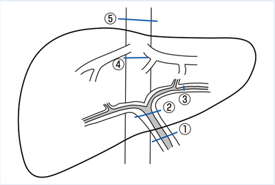

# 門脈圧亢進症

> 門脈圧が上昇した状態で、閉塞部位により肝前性・肝内性・肝後性に分類する。肝硬変は肝内性の後類洞性門脈圧亢進症の代表である。

## 要点

図：①肝前性、②前類洞性、③後類洞性、④肝外肝静脈性、⑤下大静脈性の閉塞部位（出典：ユーザー提供図、個人学習用）。

- ①肝前性：門脈本幹の閉塞（門脈血栓など）。
- ②肝内・前類洞性：肝内門脈の障害（特発性門脈圧亢進症、住血吸虫症など）。
- ③肝内・後類洞性：肝硬変など。門脈圧亢進症の原因として頻度が高い。
- ④肝後性：肝静脈閉塞（Budd–Chiari症候群など）。⑤は下大静脈閉塞や右心不全など。
- 門脈圧亢進により脾腫、血小板減少、腹水、食道静脈瘤、側副血行路（腹壁静脈怒張など）をきたす。

## CBTチェック

- 肝硬変の閉塞部位 → **肝内・後類洞性（③）**。
- 門脈圧は閉塞部位により症候の出方が異なる。図の番号と病態を対応させる。

