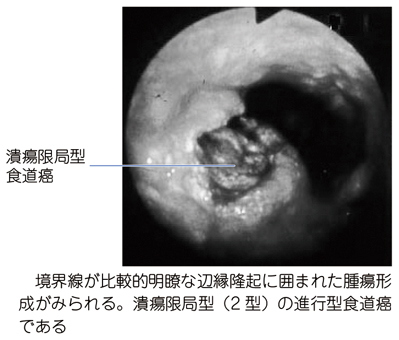
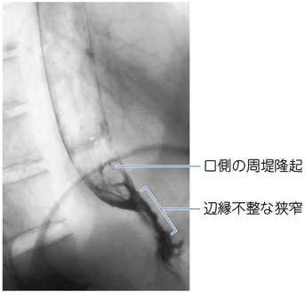

# 食道癌

> 日本では[[扁平上皮癌]]が大部分を占め、飲酒・喫煙と強く関連する。つかえ感や[[嚥下障害]]、嗄声、頸部リンパ節腫脹は進行例を示唆する。

## 要点

- 食道は重層扁平上皮で覆われるため、日本では食道癌の代表は扁平上皮癌である。
- 飲酒・喫煙は重要な危険因子であり、頭頸部癌を合併・重複しうる。
- 進行すると嚥下時のつかえ感、嚥下痛、体重減少を来し、反回神経浸潤では嗄声、気道への誤嚥ではむせを認める。
- 食道造影では、辺縁不整な狭窄や潰瘍、周堤隆起を認める。固形物から進行する嚥下障害は機械的狭窄を示唆する。
- 診断の第一選択は[[上部消化管内視鏡検査]]で、病変の観察・生検を行う。CTなどで深達度・リンパ節・遠隔転移を評価する。
- Lugol（ルゴール）染色は、正常食道扁平上皮のグリコーゲンを褐色に染め、癌などの病変を染まらない不染帯として可視化する。早期食道癌の発見や範囲診断に有用だが、炎症などでも不染帯を示しうる。ヨードアレルギーでは使用しない。
- 治療は病期により内視鏡治療、手術、化学放射線療法を選択し、食道切除後の再建には主に胃を用いる。

潰瘍限局型（2型）の進行食道癌の内視鏡像。病変の存在・範囲は内視鏡で評価し、生検で確定する。

出典：M3E CBT 問題番号18304214（ユーザー提示、個人学習用）

## CBTチェック

- 高齢男性の**飲酒・喫煙歴＋嚥下障害**では、食道扁平上皮癌を考える。
- 嗄声は反回神経麻痺、むせは誤嚥を示唆する進行所見である。
- 食道・胃・十二指腸の観察には上部消化管内視鏡検査を用い、食道切除後の再建には主に胃を使う。
- 周堤隆起と辺縁不整な狭窄を伴う潰瘍性病変 → 食道癌。肉眼的には2型（潰瘍限局型）または3型（潰瘍浸潤型）を考える。
- 問題文の「固形物から進行する嚥下困難＋急な体重減少＋食道造影の不規則な陰影欠損」→ 食道癌を考える。
- 「喫煙・飲酒歴＋嚥下困難＋嗄声」では、反回神経浸潤を伴う進行食道癌を考える。

食道造影で下部食道に周堤隆起と辺縁不整な狭窄を示す画像（ユーザー提供、個人学習用）。

不規則な陰影欠損と著明な狭窄を示す食道造影（M3E 問題番号18302790、個人学習用）。

注釈付き画像：不規則な陰影欠損の範囲を示す（同設問、個人学習用）。

出典：M3E設問画像（https://s3-ap-northeast-1.amazonaws.com/prd.question-images-tecopla.com/images/18302790J01.jpg、https://s3-ap-northeast-1.amazonaws.com/prd.question-images-tecopla.com/images/18302790K01.jpg）
