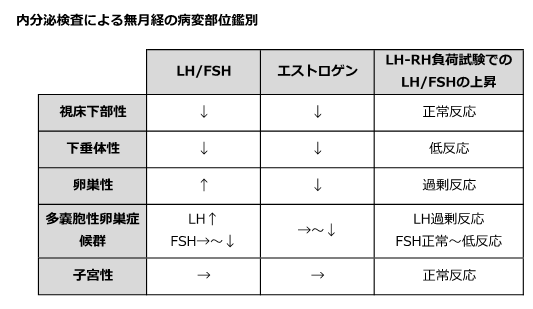

# 多嚢胞性卵巣症候群（PCOS）

> **多嚢胞性卵巣症候群**（polycystic ovary syndrome: PCOS）は、排卵障害とアンドロゲン過剰を主な病態とする疾患群で、月経異常・多毛・不妊の原因となる。

## 要点

- 日本産科婦人科学会の2024年基準では、**月経周期異常**、**多嚢胞卵巣またはAMH高値**、**アンドロゲン過剰症またはLH高値**の3項目をすべて満たすと診断する。他疾患を除外して判断する。
- 月経不順、希発月経・無月経、無排卵、不妊、多毛・ざ瘡を認める。肥満やインスリン抵抗性を伴うことがある。
- [[超音波検査]]で卵巣の腫大と多数の小卵胞を確認する。無月経の評価では、妊娠、甲状腺疾患、高プロラクチン血症、Cushing症候群なども鑑別する。
- 排卵障害のため、[[基礎体温]]は**低温相が持続する一相性**を示しやすい。
- 長期の無排卵は子宮内膜増殖症・子宮体癌のリスクにつながるため、月経周期の管理と耐糖能などの代謝リスク評価を行う。

無月経では、LH/FSH・エストロゲンとLH-RH負荷試験の反応を組み合わせると、視床下部・下垂体・卵巣などの病変部位を整理できる。

## CBTチェック

- 月経不順＋多毛・ざ瘡＋肥満 → PCOSを考え、排卵障害とアンドロゲン過剰を確認する。
- PCOSの基礎体温は、排卵後の高温相が現れにくい**一相性**が典型である。
- 下肢浮腫はPCOSの代表的な所見ではない。
