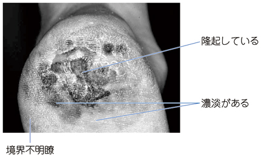

# 悪性黒色腫（メラノーマ）

> 悪性黒色腫（melanoma）は、メラノサイトが悪性化した皮膚がんである。早期からリンパ行性・血行性に転移しうるため、黒色斑の形・色・変化を見逃さない。

## 要点

- 日本では足底・手掌・爪に生じる[[末端黒子型悪性黒色腫]]が重要で、踵の黒色斑が拡大・隆起・出血する場合は疑う。
- **ABCDE**は Asymmetry（非対称）、Border irregularity（辺縁不整）、Color variegation（色むら）、Diameter（径6 mm以上）、Evolution（増大・変化）である。
- ダーモスコピーで観察し、確定診断には原則として病変全体を含む切除生検と病理検査を行う。
- 治療の基本は病変の厚さ・潰瘍・転移を評価したうえでの広範切除であり、進行例では[[センチネルリンパ節生検]]や薬物療法を検討する。
- [[基底細胞癌]]は顔面に好発し、[[有棘細胞癌]]は潰瘍性・角化性の病変が手がかりとなる。

悪性黒色腫を疑う足底病変：非対称性、境界不明瞭、色むら、隆起を確認する。

出典：M3E CBT 問題番号18301780（ユーザー提示、個人学習用）

## CBTチェック

- **足底の拡大する不整な黒色斑**では、末端黒子型悪性黒色腫を考える。
- ABCDEはスクリーニングの手がかりであり、確定には病理診断が必要である。
- 深達度・潰瘍の有無・所属リンパ節転移は、病期と治療方針に関わる。
