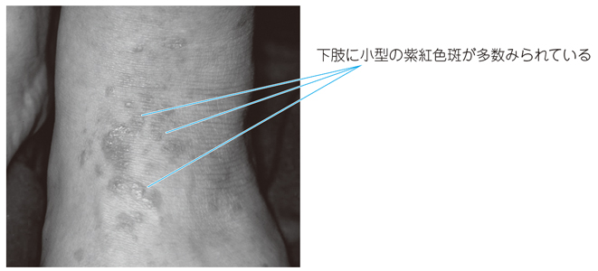

# 扁平苔癬

> 扁平苔癬は、皮膚・粘膜に生じる慢性炎症性疾患である。皮膚の紫紅色で多角形・扁平な丘疹と、口腔粘膜の白色網状線条（Wickham線条）が典型である。

## 要点

- 四肢、とくに屈側に、そう痒を伴う紫紅色の多角形・扁平隆起性丘疹を認める。
- 口腔粘膜では乳白色で網状・レース状の[[Wickham線条]]を認め、びらんや疼痛を伴うことがある。
- 病理では表皮基底層の液状変性と、表皮直下の帯状リンパ球浸潤が特徴である。
- 診断は典型的な皮膚・粘膜所見と病理所見を組み合わせて行う。
- 治療は外用ステロイドを基本とし、病変の部位・重症度に応じて治療を調整する。

下肢の紫紅色の多角形丘疹。口腔粘膜のWickham線条と組み合わせて考える。

出典：M3E CBT 問題番号18403730（ユーザー提示、個人学習用）

## CBTチェック

- **紫紅色・多角形・扁平丘疹＋白色網状線条**は扁平苔癬を考える。
- 基底層の液状変性は、扁平苔癬の病理所見として重要である。
- [[尋常性乾癬]]は境界明瞭な紅斑局面と銀白色鱗屑が手がかりとなる。
