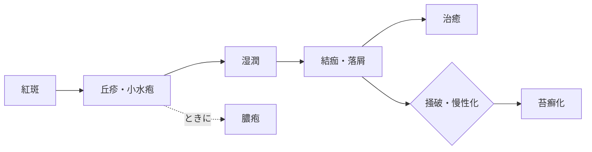

# 湿疹

> 湿疹は、外的・内的刺激による表皮を中心とした可逆性の炎症反応。紅斑、丘疹、小水疱などが混在し、経過により湿潤・落屑・結痂・苔癬化を示す。

## 要点

- 湿疹三角は、紅斑→丘疹・小水疱→湿潤・落屑・結痂→苔癬化という皮疹の構成・経時変化を表す。
- 膿疱を伴うことはあるが、**潰瘍は湿疹三角に含まれない**。
- 急性期は湿潤・小水疱、慢性化すると苔癬化が目立つ。
- 湿疹三角の流れ：紅斑 → 丘疹 → 小水疱 → 湿潤 → 結痂・落屑 → 治癒／慢性化して苔癬化。
- 湿疹では基本的に掻痒を伴う。

## 湿疹三角フローチャート

急性期は紅斑から丘疹・小水疱、湿潤、結痂・落屑へ進み、慢性化すると苔癬化が目立つ。潰瘍は湿疹三角に含まれない。

## CBTチェック

- 「湿疹三角に含まれない」→ **潰瘍**（M3E 18201680）。
- 紅斑・丘疹・小水疱・落屑・湿潤・結痂・苔癬化は湿疹の構成要素。
- 「湿疹・皮膚炎群の症候でない」→ **膨疹**。膨疹は限局性浮腫で、数時間で消退する[[蕁麻疹]]の皮疹（M3E 09130180）。
- 紅斑から始まり、丘疹・小水疱・湿潤・結痂・落屑へ進む皮疹の変化 → 湿疹三角。
