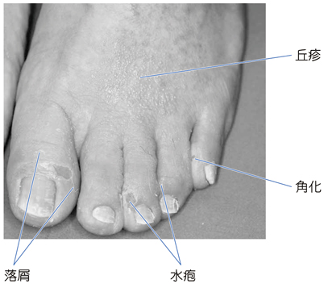

# 足白癬

> 足白癬は、白癬菌（皮膚糸状菌）が足の[[角質層]]に感染する表在性真菌症。臨床像だけでは確定できず、[[皮膚科検査の使い分け|KOH直接鏡検]]で菌要素を確認する。

## 要点

- 趾間型では趾間の浸軟・落屑、小水疱型では足底・足縁の小水疱、角質増殖型では足底の角化・亀裂が目立つ。
- 問診では家族内発症、共有するバスマット・履物、動物との接触、再発歴、使用した外用薬を確認する。日光浴歴の優先度は低い。
- 鱗屑や水疱蓋を採取し、KOHで角質を溶かして菌糸を直接鏡検する。
- 白癬菌はケラチンを利用するため、皮膚では主に角質層に存在する。
- 治療は外用抗真菌薬が基本。ステロイド単独外用は感染を悪化・非典型化させうる。

落屑・水疱・丘疹・角化を認める足白癬の皮疹（M3E 18303632、個人学習用）。痂皮は示されていない。

## CBTチェック

- 問題文の「[[糖尿病]]」ではなく、足底の**鱗屑・小水疱** → 小水疱型（汗疱状）[[足白癬]]を考える。糖尿病の直接デルマドロームではない（M3E 18105050）。
- 提示画像では落屑・水疱・丘疹・角化を認めるが、滲出液が乾いた**痂皮**は認めない（M3E 18303632）。
- [[皮膚科検査の使い分け|KOH直接鏡検]]で角質層の菌要素を確認する（M3E 18303633・18303634）。
- KOH鏡検では白癬菌の真性菌糸・分節胞子を確認する（M3E 18201670）。
