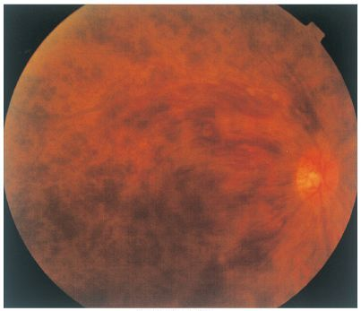

# 網膜中心静脈閉塞症

> 網膜中心静脈閉塞症（central retinal vein occlusion：CRVO）は、網膜中心静脈の閉塞によって網膜全体にうっ血・出血・浮腫を生じ、突然の無痛性視力低下をきたす疾患である。

## 要点

- 高齢、高血圧、糖尿病、[[緑内障]]などが危険因子となる。
- 眼底では四象限に広がる網膜出血、静脈の怒張・蛇行、乳頭浮腫、綿花様白斑を認める。
- 視力低下の主因は[[黄斑浮腫]]や黄斑虚血で、眼底検査や光干渉断層計（optical coherence tomography：OCT）で評価する。
- 網膜虚血 → 血管内皮増殖因子（vascular endothelial growth factor：VEGF）増加 → 虹彩新生血管（ルベオーシス）→ [[血管新生緑内障]]をきたしうる。
- 黄斑浮腫には抗VEGF薬の硝子体内注射、新生血管には網膜光凝固などを行う。

網膜後極部から広範囲に出血がみられる。

## CBTチェック

- 高齢・高血圧＋突然の無痛性視力低下＋網膜全体の多発出血 → 網膜中心静脈閉塞症。
- 虚血型ではVEGFにより[[血管新生緑内障]]を合併しうる。
- [[網膜中心動脈閉塞症]]は乳白色眼底と[[cherry-red spot]]が特徴で、網膜出血主体の本症と区別する。
