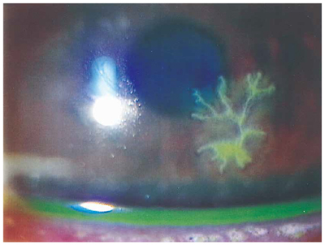

# 角膜ヘルペス

> 角膜ヘルペス（単純ヘルペス角膜炎）は、三叉神経節に潜伏した単純ヘルペスウイルス（herpes simplex virus：HSV）が再活性化して角膜に病変を生じる疾患である。

## 要点

- 角膜上皮型では、先端が瘤状に膨らむ特徴的な[[樹枝状角膜潰瘍]]を認める。
- 樹枝状病変は[[フルオレセイン染色]]で明瞭になり、細隙灯顕微鏡で観察する。
- 異物感、流涙、羞明、結膜充血、視力低下などを生じ、角膜知覚は低下することがある。
- 疲労、発熱、紫外線曝露、免疫抑制などを契機に再発する。
- 治療は抗ウイルス薬の[[アシクロビル]]やガンシクロビルなどを用いる。上皮型にステロイド点眼を単独使用すると悪化しうる。

フルオレセイン染色で、木の枝のように分岐する[[樹枝状角膜潰瘍]]を認める。

## CBTチェック

- 樹枝状病変＋先端のterminal bulb → HSVによる[[角膜ヘルペス]]。外傷後の不整形な上皮欠損は[[角膜びらん]]を考える。
- HSVは三叉神経節に潜伏し、再活性化して角膜炎を起こす。
- 角膜上皮型の治療は抗ウイルス薬であり、ステロイド点眼単独は避ける。
