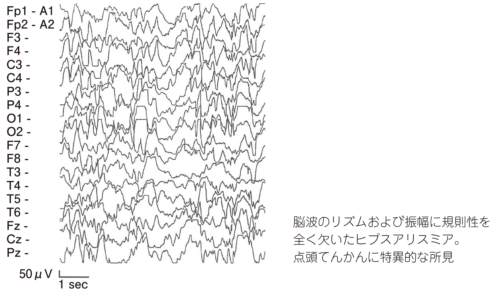

# West症候群（点頭てんかん）

> **West症候群**は、乳児期に発症するてんかん性脳症で、てんかん性スパズム、発達の停滞・退行、脳波のヒプスアリスミアを特徴とする。

## 要点

- 生後数か月〜1歳頃に多く、突然両上肢を振り上げる、体幹を屈曲するなどのスパズムを群発する。
- 追視・笑顔・お座りなどの発達が止まる、または退行することがある。
- 脳波で高振幅・不規則な徐波と棘波が混在するヒプスアリスミアを認める。
- 早期治療が重要で、ACTH療法や抗てんかん薬などを用いる。治療効果は発作消失と脳波改善で評価する。

脳波のリズムと振幅が不規則なヒプスアリスミア（M3E 09530460、個人学習用）。

## CBTチェック

- 「乳児の発達退行」＋「両上肢を振り上げる発作」＋「ヒプスアリスミア」→ West症候群。
- West症候群を疑ったら経過観察せず、早急に治療を開始する。
- 問題文の「物音に驚いたように両上肢を振り上げる」→ 乳児スパズムを考える。
