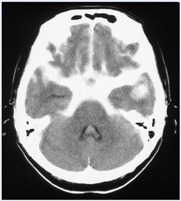

# くも膜下出血

> くも膜下腔へ出血する病態で、主因は[[脳動脈瘤]]の破裂。突然の激しい頭痛（雷鳴頭痛）は緊急評価を要する。

## 要点

- 典型像は**突然発症する激しい頭痛**、嘔吐、[[意識障害]]、項部硬直であり、意識は[[Japan Coma Scale（JCS）]]などで評価する。
- 疑ったらまず**頭部単純CT**を行い、脳底槽・脳溝・シルビウス裂の高吸収域を確認する。
- CTで不明でも疑いが強ければ、頭蓋内圧亢進を除外したうえで髄液のキサントクロミーを確認する。
- [[脳動脈瘤]]の再出血は発症早期、特に24時間以内に多く、急な再増悪の原因となる。治療はクリッピング術またはコイル塞栓術で再出血を防ぐ。
- 合併症には急性水頭症と、発症数日後に起こりやすい[[脳血管攣縮]]がある。

脳底槽に星形の高吸収域を認める、くも膜下出血の頭部単純CT像（M3E 18303423、個人学習用）。

## CBTチェック

- [[頭痛の鑑別|雷鳴頭痛・嘔吐・意識障害]]では、MRIや脳波より**頭部単純CTを優先**する（M3E 18303422）。
- 脳底槽の星形（ペンタゴン型）高吸収域は本症を示唆する（M3E 18303423）。
- 一度軽快した頭痛が翌日に再発し、嘔吐・意識消失を伴うなら、破裂動脈瘤の**再出血**を考える（M3E 18303424）。
