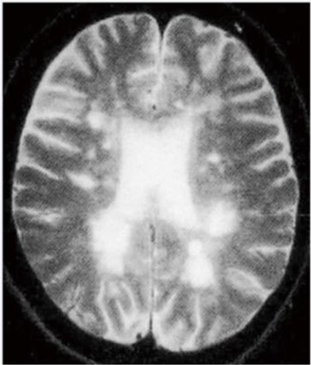

# 多発性硬化症

> **多発性硬化症（multiple sclerosis：MS）**は、中枢神経の脱髄病変が時間的・空間的に多発する自己免疫性疾患で、若年女性に多い。再発と寛解を繰り返す。

## 要点

- 視神経炎、眼球運動障害、感覚障害、筋力低下、膀胱直腸障害などが病変部位に応じて出現する。
- 症状が一度軽快した後、別の部位の症状が出現する「時間的・空間的多発」が手掛かりになる。
- 急性増悪では高用量ステロイドパルス療法を行う。無効例では血漿交換療法を検討する。
- 再発予防には疾患修飾薬を用いる。インターフェロンβは古典型MSの再発予防薬で、急性増悪時の治療薬ではない。
- 視神経脊髄炎スペクトラム障害（NMOSD）では抗AQP4抗体が手掛かりとなり、MSとは治療方針が異なる。

T2強調MRIで側脳室周囲に多発する高信号病変を示す（M3E 18201360、個人学習用）。

## CBTチェック

- 「若年女性」＋「視力低下・複視・顔面症状・排尿障害」＋「寛解と再発」→ MSの急性増悪を考える。
- 「急性増悪」→ ステロイドパルス療法。「再発予防」→ インターフェロンβなどの疾患修飾薬。
- 「視神経炎＋長い脊髄病変」や「抗AQP4抗体」→ NMOSDを考え、MS治療薬をそのまま選ばない。
- 「若年者の視力低下・麻痺・しびれが時間を隔てて反復」＋「T2高信号病変」→ 時間的・空間的多発を示すMSを考える。
