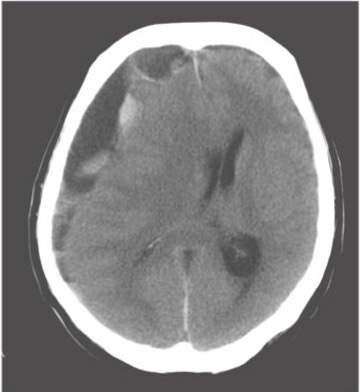

# 慢性硬膜下血腫

> **慢性硬膜下血腫**は、軽微な頭部外傷後に硬膜下腔へ血液が貯留し、数週後に頭痛・認知機能低下・片麻痺などを呈する疾患である。

## 要点

- 高齢者、抗凝固薬・抗血小板薬使用者、飲酒者では起こりやすい。受傷歴が明確でないこともある。
- 頭痛、嘔吐、歩行障害、意識・認知機能の変化、片麻痺は頭蓋内圧亢進や圧迫を示唆する。
- **まず頭部単純CT**を行う。脳表に沿う三日月形の低吸収域、脳溝の消失、側脳室圧排・正中偏位を確認する。
- 単純CTで腫瘍などの器質的病変との鑑別が必要な場合は、**その後に造影CT**を追加する。必要に応じてMRIも用いる。
- 症候性または圧迫所見が強い場合は、穿頭血腫ドレナージを検討する。

右前頭葉〜側頭葉の脳表に沿う三日月形の混合吸収域と、脳の圧迫を示す（M3E 18200910、個人学習用）。

## CBTチェック

- 急性硬膜下血腫：三日月形の高吸収域／慢性硬膜下血腫：三日月形の低〜等吸収域。
- 急性期の外傷性硬膜下血腫は[[急性硬膜下血腫]]として、硬膜外血腫とのCT形状・出血源の違いを整理する。
- 頭部外傷後に亜急性〜慢性に出現する片麻痺・頭痛では、**単純CT → 必要時に造影CT**の順で評価する。
- 頭蓋内圧亢進が疑われる場合、画像評価前の[[腰椎穿刺]]は脳ヘルニアの危険があり避ける。
- 「くも膜肥厚」は基本所見ではない。血腫の被膜が造影されることはあるが、くも膜自体の肥厚とは区別する。
