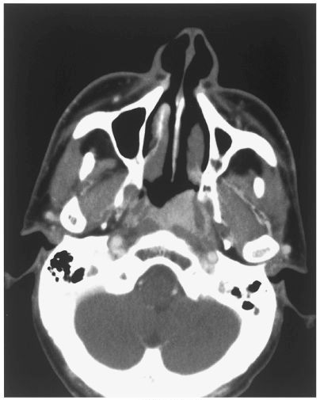

# 上咽頭癌

> 上咽頭に生じる悪性腫瘍で、[[EBウイルス]]との関連が知られる。耳管を閉塞すると、成人の片側性[[滲出性中耳炎]]・耳閉感・難聴として発見される。

左上咽頭の軟部組織腫瘤を示す造影CT。M3E CBT 問題番号10900280、個人学習用。

## 要点

- 症状は耳閉感・難聴、鼻閉・鼻出血、無痛性頸部リンパ節腫脹などである。
- 耳管開口部の閉塞 → 中耳換気障害 → **片側性滲出性中耳炎**となる。
- 進行例では複視、顔面の感覚障害などの脳神経症状を来しうる。
- 内視鏡と生検で確定診断し、CT/MRIで進展・転移を評価する。治療の中心は放射線治療と薬物療法である。

## CBTチェック

- **成人の片側性滲出性中耳炎**では、上咽頭癌など耳管閉塞病変を除外する。
- 耳症状＋鼻症状／頸部リンパ節腫脹／脳神経症状の組合せから上咽頭癌を考える。
