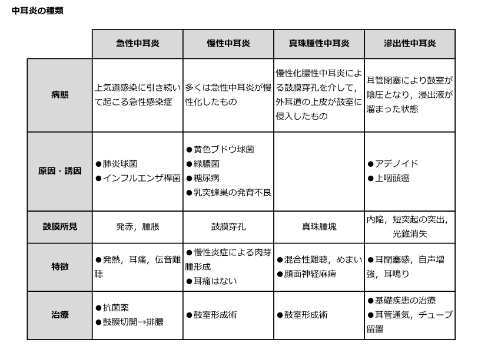

# 中耳炎の鑑別

> 鼓膜の正常ランドマークは[[耳鏡検査]]を参照する。

> 耳痛・発熱を伴う急性中耳炎、鼓膜穿孔と耳漏が持続する慢性中耳炎、骨破壊を来す[[真珠腫性中耳炎]]、貯留液による滲出性中耳炎を、鼓膜所見と経過で区別する。

中耳炎の病態、鼓膜所見、症候、治療の比較図（ユーザー提供画像）。

## 要点

| 病型 | 鑑別の要点 | 主な対応 |
| --- | --- | --- |
| [[急性中耳炎]] | 感冒後の耳痛・発熱、鼓膜発赤・膨隆 | 鎮痛、重症度に応じて[[抗菌薬]]・鼓膜切開 |
| [[慢性中耳炎]] | 鼓膜穿孔と反復・持続する耳漏、伝音難聴 | 耳漏の制御後に鼓膜形成術・鼓室形成術を検討 |
| [[真珠腫性中耳炎]] | 弛緩部陥凹、白色の角化物、骨破壊 | CTで進展を評価し、原則として手術 |
| [[滲出性中耳炎]] | 炎症症状に乏しい中耳貯留液、鼓膜陥凹・液面 | 原因治療、経過観察；遷延例は鼓膜換気チューブ |

- 急性中耳炎はウイルス感染に続く細菌感染を伴うことが多く、耳痛・発熱、鼓膜の発赤・膨隆が手がかりとなる。
- 急性中耳炎の主な起炎菌は[[肺炎球菌]]・[[インフルエンザ菌]]・[[Moraxella catarrhalis]]である。
- 真珠腫性中耳炎は、耳管機能障害による鼓膜弛緩部（または緊張部後上方）の陥凹に角化上皮が入り込み、白色角化物を貯留して骨を破壊する。治療は原則として病変摘出を伴う鼓室形成術である。
- 滲出性中耳炎では耳閉感、耳鳴り、伝音難聴を呈し、[[ティンパノメトリー]]は平坦なB型を示すことが多い。
- 成人の片側性滲出性中耳炎では、耳管を閉塞する[上咽頭癌](上咽頭癌.md)などの上咽頭腫瘍を除外する。
- 鼓膜穿孔がある場合、ゲンタマイシンなど聴器毒性をもつ薬剤の局所使用は内耳障害の危険があるため避ける。

## CBTチェック

- **鼓膜発赤・膨隆＋耳痛・発熱**は急性中耳炎、**鼓膜穿孔＋慢性耳漏**は慢性中耳炎を考える。
- **弛緩部の陥凹・角化物**やめまい、顔面神経麻痺は真珠腫性中耳炎を示唆する。外側半規管の骨破壊はめまいの原因となる。
- **液面形成・鼓膜陥凹＋難聴**は滲出性中耳炎を疑う。急性炎症所見に乏しい点が急性中耳炎との対比で重要である。
- 真珠腫性中耳炎は腫瘍名だが悪性腫瘍ではなく、骨破壊性の慢性中耳炎である。
- 耳漏・耳痛を起点とする分岐は[[耳鼻科：症状から考える鑑別まとめ]]を参照する。
