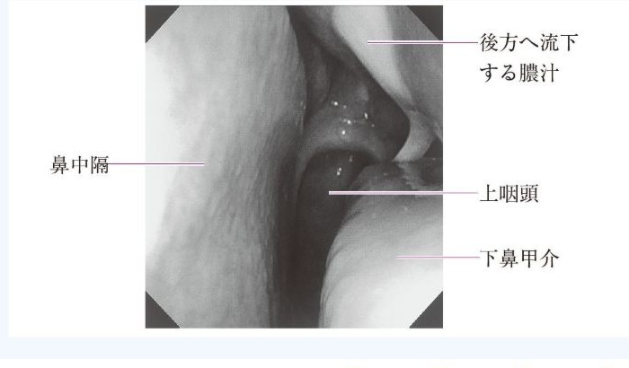

# 副鼻腔炎

> 副鼻腔の開口部は[[鼻腔・副鼻腔の開口部]]を参照する。

> 急性鼻副鼻腔炎は、感冒などに続いて鼻腔・副鼻腔に急性炎症を生じる病態である。鼻症状に加え、罹患洞に対応する顔面痛・頭痛・圧痛を認める。

## 要点

- 急性はおおむね発症4週以内で、鼻閉、膿性鼻漏・後鼻漏、嗅覚低下、頭痛や顔面圧迫感を来す。
- 前頭洞炎では前額部・眉間、上顎洞炎では頬部、篩骨洞炎では眼周囲の痛み・圧痛が手がかりとなる。
- 診断は症状と鼻内所見を基本とし、重症例・合併症が疑われる場合はCTで副鼻腔を評価する。
- 治療は鎮痛などの対症療法を行い、10日以上の膿性鼻汁、いったん軽快後の再増悪、高熱や強い顔面痛を伴う細菌性が疑われる例では[[抗菌薬]]を検討する。
- 眼瞼腫脹、眼球運動障害、視力低下、[[意識障害]]、髄膜刺激症状は眼窩内・頭蓋内合併症を疑う所見である。

鼻中隔・下鼻甲介の間にみられる膿性後鼻漏を示す鼻内視鏡像。

出典：M3E CBT 問題番号10930270（個人学習用）

## CBTチェック

- [[頭痛の鑑別|感冒後の頭痛＋眉間の叩打痛]]は前頭洞炎を考える。
- 発熱・項部硬直などの髄膜刺激症状があれば、[[髄膜炎]]を優先して鑑別する。
- 痛みの部位と副鼻腔の位置を対応させる。
