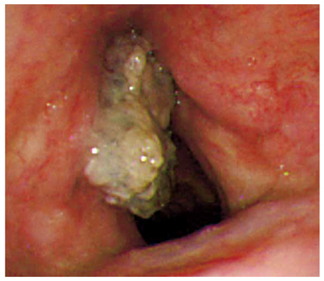

# 喉頭癌

> 喉頭に生じる悪性腫瘍で、大部分は扁平上皮癌である。声門（声帯）癌が多く、**持続する嗄声**が早期からの重要な症状となる。

右声帯の不整で白色角化を伴う腫瘤。M3E CBT 問題番号18207860、個人学習用。

## 要点

- 喫煙は主要なリスク因子で、飲酒もリスクを高める。男性に多い。
- 声門癌は嗄声が早期から出現する。声門上癌では咽頭違和感・嚥下痛、頸部リンパ節腫脹などで見つかることがある。
- 内視鏡では表面不整・白色角化を伴う腫瘤を認める。**確定診断は生検**で行う。
- 早期例は放射線治療または喉頭温存手術、進行例は化学放射線療法や喉頭全摘術を検討する。

## CBTチェック

- 喫煙者の**1か月以上続く嗄声**では喉頭癌を疑う。
- 声帯ポリープ・声帯嚢胞は平滑な腫瘤、声帯結節は前1/3の両側性結節が典型である。
