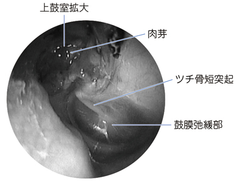
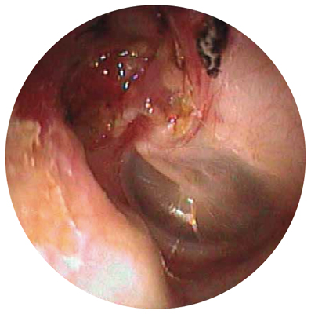

# 真珠腫性中耳炎

> 鼓膜、とくに弛緩部の陥凹に角化上皮が入り込んで増殖し、中耳の骨を破壊しうる慢性中耳炎である。難聴・耳漏を呈し、進展するとめまいや顔面神経麻痺を生じうる。

上鼓室の拡大と肉芽を認める耳内視鏡所見。

鼓膜弛緩部から上鼓室にかけての病変を示す耳内視鏡所見。

## 要点

- 耳管機能障害による鼓膜弛緩部の陥凹から生じ、真珠腫が耳小骨や側頭骨を破壊する。
- [[急性中耳炎]]・[[慢性中耳炎]]・[[滲出性中耳炎]]との鑑別は、[[中耳炎の鑑別]]を参照する。
- 主な症状は悪臭を伴う耳漏、伝音難聴、耳鳴りである。外側半規管骨包まで進展すると、瘻孔により外耳道の圧変化でめまいを来す。
- 鼓膜の観察、[[純音聴力検査]]、側頭骨CTで診断・進展度を評価する。真珠腫の除去を目的に手術を行う。
- 顔面神経麻痺、髄膜炎、脳膿瘍などの合併症に注意する。

## CBTチェック

- 鼓膜弛緩部の陥凹・上鼓室病変、耳漏、伝音難聴から[[真珠腫性中耳炎]]を疑う。
- 外側半規管骨包の破壊では、耳介牽引や外耳道への圧でめまいを誘発する[[瘻孔症状検査]]が陽性となりうる。注視眼振検査・立ち直り反射検査も、めまいの評価に用いる。
- **ティンパノメトリー**は鼓膜の可動性・中耳圧を測る検査であり、鼓膜に明らかな異常がある本例では適さない。難聴の程度・型の評価には純音聴力検査を行う。
- 嗄声は[[Wallenberg症候群]]などの延髄病変、筋萎縮は末梢神経・筋疾患を示唆する所見であり、真珠腫性中耳炎の典型ではない。
