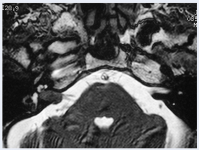

# 聴神経腫瘍（前庭神経鞘腫）

> **聴神経腫瘍**は、多くが前庭神経のSchwann細胞由来である良性腫瘍（前庭神経鞘腫）である。片側の[[難聴の鑑別|感音難聴]]・耳鳴・ふらつきから疑う。

## 要点

- 名称に反して、主に**前庭神経**から発生する。多くは内耳道から小脳橋角部へ進展する。
- 典型的には進行性の片側感音難聴、片側耳鳴、語音明瞭度低下を認める。ゆっくり増大するため、反復する激しい回転性めまいは典型的ではない。
- 進行例では顔面神経・三叉神経、小脳、脳幹の圧迫による顔面感覚低下、顔面神経麻痺、失調、水頭症を来すことがある。
- 片側・左右差のある感音難聴では[[純音聴力検査]]を行い、内耳道〜小脳橋角部のMRIで腫瘤を確認する。
- 治療は腫瘍径、増大、聴力、年齢を考慮して経過観察、[[放射線治療]]、手術から選択する。

内耳道に生じた腫瘤のMRI例。画像で腫瘤を確認して診断し、病理学的にはSchwann細胞由来である。

## CBTチェック

- 片側感音難聴＋耳鳴 → 聴神経腫瘍を疑い、MRIを行う。
- Schwann細胞由来の腫瘍 → 聴神経腫瘍。
- 両側性の前庭神経鞘腫では[[神経線維腫症2型]]を考える。
