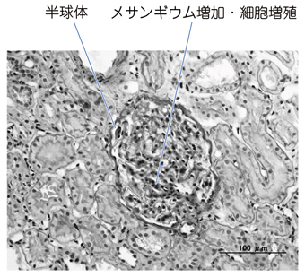

# IgA腎症

> **IgA腎症**は、糸球体メサンギウム領域へのIgA優位の沈着を特徴とする慢性糸球体腎炎である。持続する血尿・蛋白尿を来し、上気道感染と同時期〜数日後に肉眼的血尿が出現することがある。

## 要点

> 光学顕微鏡ではメサンギウム細胞・基質の増加を認める。

- 持続性の顕微鏡的血尿が典型で、蛋白尿を伴う。肉眼的血尿は上気道・扁桃の炎症とほぼ同時〜数日後に出現しうる。
- 活動性の血尿では[[赤血球円柱]]を認めることがあり、[[尿沈渣と円柱]]で糸球体性血尿を確認する。
- 腎生検でメサンギウム増殖を認め、蛍光抗体法でメサンギウム領域にIgAの顆粒状沈着を確認して診断する。
- 血清IgAが高値となることがあるが、血清IgAのみでは診断できない。血清補体価（C3・C4）は通常保たれる。
- [[ネフローゼ症候群]]を呈するほどの高度蛋白尿は典型的ではないが、持続する蛋白尿・高血圧を伴う進行例ではネフローゼ症候群や[[慢性腎臓病（CKD）|慢性腎臓病]]に至りうる。
- [[急性糸球体腎炎]]と異なり、感染から時間をおかずに血尿が出現する。

## CBTチェック

- 疾患横断の鑑別は[[原発性糸球体疾患の鑑別]]で確認する。
- **上気道感染と同時期の肉眼的血尿＋メサンギウムIgA沈着**はIgA腎症を考える。
- 我が国では、IgA腎症は慢性糸球体腎炎の代表的かつ頻度の高い原因である。
- [[IgA血管炎]]では紫斑・腹痛・関節症状を伴うことがある。
