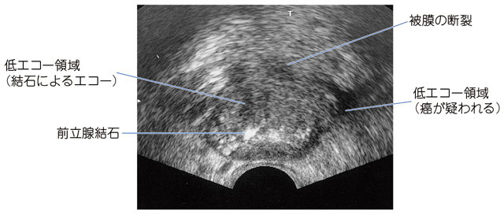

# 前立腺癌

> **前立腺癌**は高齢男性に多く、前立腺の辺縁域に好発する。PSA高値、直腸診、MRI・経直腸超音波で疑い、**前立腺生検で確定**する。

辺縁域の低エコー領域と被膜断裂は、前立腺癌・被膜外進展を疑う所見である。

## 要点

- 高齢男性に好発し、前立腺の**辺縁域（peripheral zone）**に多い。[[前立腺肥大症]]は移行域に生じる。
- 直腸診では左右非対称の腫大、結節性硬結、石様硬を認めることがある。
- 経直腸超音波では辺縁域の低エコー病変、被膜外進展を疑う所見などをみるが、超音波所見だけで確定はできない。
- PSAは前立腺特異的だが癌特異的ではない。PSA高値や直腸診異常ではMRIを行い、多部位の針生検で病理診断する。
- 骨盤・腰椎などへの**造骨性骨転移**が多い。骨シンチグラフィは[[骨転移]]の評価に有用である。
- 高齢男性の造骨性骨転移では前立腺癌を考え、[[腫瘍マーカー]]としてPSAを測定する。ただしPSAは前立腺肥大症などでも上昇しうるため、確定診断は生検で行う。

## 治療

- 低リスク限局癌では、定期的なPSA測定・生検などで病勢を追う**監視療法**を選択できる。
- 限局癌の根治治療は、[[前立腺全摘除術]]または放射線療法である。
- 進行・転移癌の基本はアンドロゲン除去療法であり、去勢抵抗性となった再燃例などで化学療法を行う。
- [[経尿道的前立腺切除術]]は主に[[前立腺肥大症]]に対する排尿障害の手術であり、前立腺癌の根治術ではない。

## CBTチェック

- **前立腺辺縁域の低エコー病変**は前立腺癌を疑う所見である。
- 前立腺癌の確定診断はPSAや超音波ではなく、**生検**で行う。
- 前立腺癌の好発部位は**辺縁域**、[[前立腺肥大症]]は**移行域**である。
- 限局癌では監視療法・前立腺全摘除術・放射線療法が選択肢であり、経尿道的前立腺切除術は根治術ではない。
