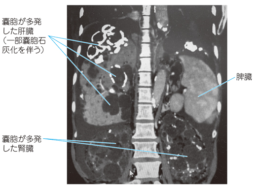

# 常染色体優性多発性嚢胞腎（ADPKD）

> **常染色体優性多発性嚢胞腎**（autosomal dominant polycystic kidney disease：ADPKD）は、両腎に多数の嚢胞が増大する遺伝性疾患である。腎機能が徐々に低下し、腎外病変も伴う。

腹部CTで、両腎と肝臓に多数の嚢胞を認める。

## 要点

- **常染色体優性遺伝**で、PKD1・PKD2遺伝子異常が代表的である。
- 両側腎の多発嚢胞・腎腫大を認め、肝嚢胞を合併しやすい。
- 高血圧、血尿、側腹部痛、尿路結石、嚢胞感染を来し、進行すると慢性腎臓病・腎不全となる。
- 腎外病変として[[脳動脈瘤]]、心臓弁異常、膵嚢胞などを合併しうる。
- 超音波・CT・MRIで診断し、血圧管理を行う。進行リスクが高い例ではトルバプタンを検討し、末期腎不全では透析・腎移植を行う。

## CBTチェック

- ADPKD = **常染色体優性遺伝**である。
- 多発性腎・肝嚢胞に**脳動脈瘤**を組み合わせる。
- 常染色体劣性多発性嚢胞腎（ARPKD）は乳幼児期に重症化しやすく、肝線維症を伴う。
