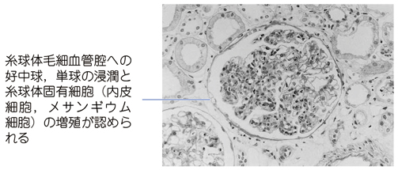
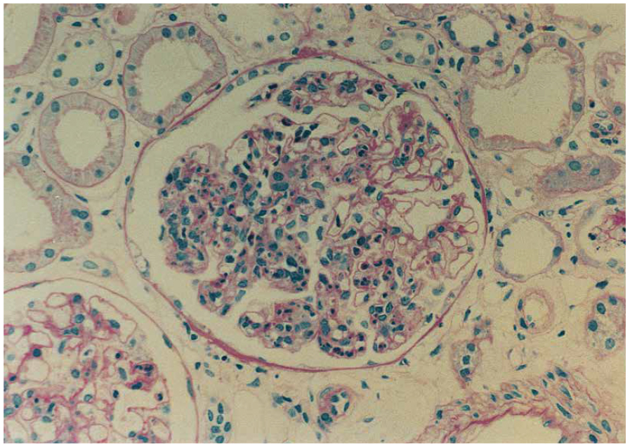

# 急性糸球体腎炎

> **急性糸球体腎炎**は、感染後などに生じる糸球体の急性炎症である。CBTではA群β溶血性[[レンサ球菌]]感染後の急性腎炎症候群が典型である。

## 要点

- 咽頭炎後約10日、皮膚感染後は約3週で発症する。感染そのものではなく、免疫複合体による糸球体障害（III型アレルギー）が主な病態である。
- 血尿（コーラ色尿）、蛋白尿、乏尿、浮腫、高血圧を認める。糸球体炎症 → **GFR低下** → Na・水貯留 → 浮腫・高血圧となる。
- 尿沈渣で変形赤血球・赤血球円柱を認める。[[ASO（抗ストレプトリジンO）]]・ASK上昇、CH50・C3低下、C4正常が典型で、C3は通常6〜8週で正常化する。
- 光顕では好中球浸潤を伴う[[管内増殖性糸球体腎炎]]、蛍光抗体法ではIgG・C3の顆粒状沈着、電子顕微鏡では上皮下の高電子密度沈着物（**hump**）を認める。
- 治療は安静、塩分・水分制限を基本とし、浮腫・高血圧には利尿薬や降圧薬を用いる。小児の予後は一般に良好だが、急性腎障害・高血圧性脳症・心不全に注意する。

糸球体毛細血管腔への好中球・単球浸潤と、メサンギウム細胞・内皮細胞の増加を認める。

## CBTチェック

- 疾患横断の鑑別は[[原発性糸球体疾患の鑑別]]で確認する。
- 「溶連菌咽頭炎の約10日後＋コーラ色尿＋浮腫＋高血圧＋C3低下」は本症を考える。
- 本症の浮腫の中心機序は、血漿膠質浸透圧低下ではなく**GFR低下によるNa・水排泄低下**である。
- [[IgA腎症]]は感染とほぼ同時に血尿が出現し補体は通常正常であるのに対し、本症は感染後に間隔をおき一過性低補体血症を示す。
