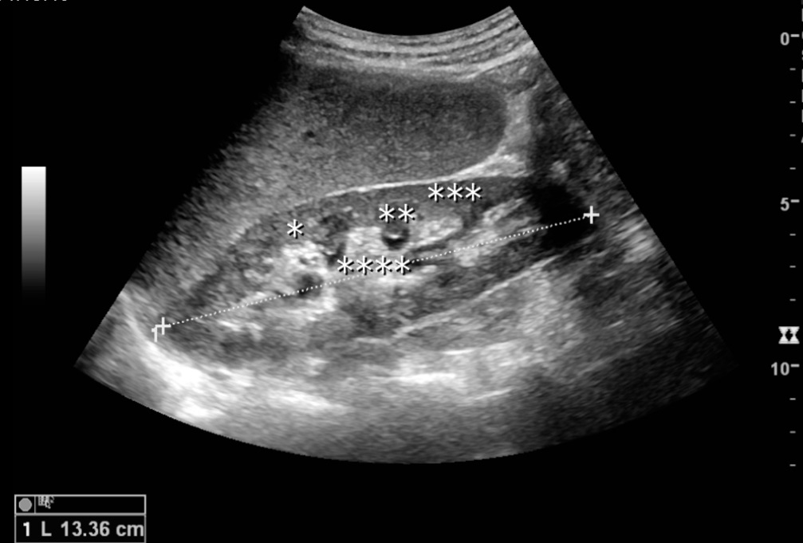
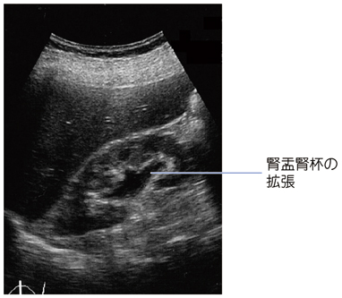
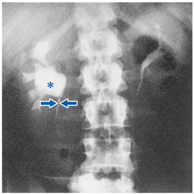

# 水腎症

> **水腎症**は、尿路通過障害により腎盂・腎杯が拡張した状態である。腹部超音波で、腎洞の高エコー内に連続する低エコー領域として確認する。

## 画像所見

正常腎では、腎洞の脂肪・血管・非拡張の腎盂腎杯が**central echo complex（CEC）**として高エコーにみえる。

水腎症では、腎盂腎杯が拡張し、CEC内に連続する低エコー領域が現れる。

排泄性尿路造影では、右腎盂・腎杯の拡張と腎盂尿管移行部の狭窄を認める。

- 原因は[[尿管結石]]、[[前立腺肥大症]]、骨盤内腫瘍などの尿路閉塞である。小児では先天性[[腎盂尿管移行部狭窄症]]が多い。尿管には[3か所の生理的狭窄](../../../01_基礎医学/解剖/泌尿生殖器の解剖.md)がある。
- 両側の閉塞、または単腎での閉塞では[[急性腎障害]]を来しうる。
- 腎嚢胞は通常、丸い低エコー領域で互いに連続しない。水腎症では腎盂・腎杯の拡張が連続する。
- 初期・軽度の閉塞では水腎症を認めないこともあり、超音波所見だけで閉塞を完全には否定できない。

正常腎画像：Hansen KL, Nielsen MB, Ewertsen C. CC BY 4.0、[Wikimedia Commons](https://commons.wikimedia.org/wiki/File:Normal_adult_kidney.jpg)

## CBTチェック

- **腎洞内の連続する低エコー領域**は水腎症を考える。
- 腎実質の多数の嚢胞を認める[[常染色体優性多発性嚢胞腎（ADPKD）|多発性嚢胞腎]]とは区別する。
