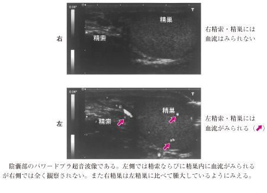

# 精巣捻転

> **精巣捻転**は、精索がねじれて精巣血流が途絶する**急性陰嚢症**である。精巣壊死を防ぐため、疑ったら緊急手術を行う。

カラードプラ超音波で、右精巣・精巣上体の血流が描出されない。

## 要点

- 思春期に多く、突然の片側陰嚢痛、精巣腫脹・高位、悪心・嘔吐を来す。
- **精巣挙筋反射の消失**は精巣捻転を強く示唆する。
- カラードプラ超音波では患側精巣の血流低下・消失を認める。精巣上体炎では血流増加が典型である。
- 発熱、白血球増多、膿尿などの炎症所見に乏しいことが多い。
- 疑ったら発症6時間以内を目安に緊急の捻転解除・両側精巣固定術を行う。検査で手術を遅らせない。

## CBTチェック

- 突然の強い陰嚢痛 + 精巣挙筋反射消失 → **精巣捻転**を最優先で考える。
- 患側精巣の血流消失は精巣捻転を支持する。
- 精巣上体炎では発熱・膿尿や精巣上体の血流増加を認めやすい。
